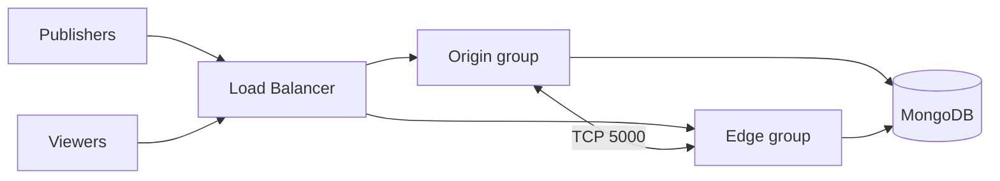

# Enterprise Deployment Hub

This page is the starting point for teams running **Ant Media Server Enterprise Edition in production**. Use it as a single entry point for planning, deployment, hardening, operating, and getting help.

## Production deployment checklist

Work through this list before going live.

### Infrastructure

- [ ] Instance meets the minimum sizing: **4 vCPUs (compute-optimized), 8 GB RAM, SSD storage** for a single server. Validate real capacity with [WebRTC load testing](/guides/load-testing/webrtc-load-testing/).
- [ ] Operating system is supported (Ubuntu 20.04/22.04/24.04, CentOS/Rocky/Alma 8-9, RHEL 9) — see [Introduction](/) and [Choose your path](/#choose-your-path).
- [ ] Required ports are open: 5080 (HTTP panel), 5443 (HTTPS), 1935 (RTMP), UDP 50000–60000 (WebRTC media), and TCP 5000 between cluster nodes only.
- [ ] For expected growth, deployment model is chosen deliberately: [standalone](/guides/installing-on-linux/installing-ams-on-linux/), [cluster](/guides/clustering-and-scaling/manual-configuration/cluster-installation/), [Kubernetes](/guides/clustering-and-scaling/kubernetes/deploy-ams-on-kubernetes/), or [Docker](/guides/installing-on-linux/ams-docker-installation/).

### Security hardening

- [ ] [SSL is configured](/guides/installing-on-linux/setting-up-ssl/) with a valid certificate for your domain.
- [ ] Default Web Panel credentials are changed and [user roles](/get-started/user-management/) are assigned.
- [ ] REST API is secured with [IP filtering or JWT](/guides/developer-sdk-and-api/rest-api-guide/securing-rest-apis/).
- [ ] Stream security is enabled where needed: [JWT stream tokens](/guides/stream-security/jwt-stream-security-filter/), [one-time tokens](/guides/stream-security/one-time-token-control/), or [webhook authorization](/guides/stream-security/webhook-stream-authorization/).
- [ ] [Undefined/unexpected streams are rejected](/guides/stream-security/accepting-undefined-streams/).
- [ ] [CORS filter](/guides/stream-security/cors-filter/) is configured for your domains.
- [ ] Cluster port 5000 and MongoDB port 27017 are **not** reachable from the public internet.
- [ ] Review [Security and Privacy](/get-started/security-and-privacy/) for organizational and compliance expectations.

### Streaming configuration

- [ ] [Adaptive bitrate](/guides/adaptive-bitrate/adaptive-bitrate-streaming/) resolutions/bitrates match your content and audience networks.
- [ ] If transcoding at scale, [GPU acceleration](/guides/advanced-usage/using-nvidia-gpu/) is configured on origin nodes.
- [ ] For viewers on restricted networks, a [TURN server](/guides/advanced-usage/overcoming-restricted-networks-webrtc-ams/) is deployed.
- [ ] [Recording](/guides/recording-live-streams/mp4-and-webm-recording/) and [S3 storage](/guides/recording-live-streams/s3-recording-and-integration/aws-s3/) are configured if recordings are required.

### Operations

- [ ] Monitoring with alerting is set up: [Grafana](/guides/monitoring/monitoring-ams-with-grafana/), [Prometheus/Loki](/guides/monitoring/loki-prometheus-setup/), or [New Relic](/guides/monitoring/monitor-ant-media-server-statistics-with-new-relic/). Alert on sustained CPU/memory above 70%.
- [ ] [Webhooks](/guides/developer-sdk-and-api/webhooks/) are wired into your systems for stream lifecycle events.
- [ ] An upgrade procedure is agreed (see below) and tested in a staging environment.
- [ ] MongoDB (in cluster mode) has backups and, ideally, a replica set.

## Cluster architecture overview

For anything beyond a single server, Ant Media Server scales with an **origin-edge cluster**:

| Component | Role |
| --------- | ---- |
| Origin nodes | Ingest publishers, transcoding/transmuxing |
| Edge nodes | Fetch from origins and serve viewers |
| MongoDB | Shared stream metadata and node registry |
| Load balancer (Nginx/HAProxy) | Single entry point; routes publish vs play traffic |

Start with [cluster installation](/guides/clustering-and-scaling/manual-configuration/cluster-installation/), then pick your platform guide: [AWS](/guides/clustering-and-scaling/aws/clustering-with-aws/), [Azure](/guides/clustering-and-scaling/azure/setup-ams-clustering-at-azure/), [GCP](/guides/clustering-and-scaling/gcp/gcp-cluster-deployment/), or [Kubernetes/Helm](/guides/clustering-and-scaling/kubernetes/deploy-ams-with-helm/).

## Upgrade and rollback

- Follow the [upgrade guide](/guides/installing-on-linux/upgrading-ant-media-server/). Always back up `/usr/local/antmedia/conf`, application settings, and the database first.
- Review the [GitHub releases](https://github.com/ant-media/Ant-Media-Server/releases) for breaking changes **before** upgrading.
- In clusters, upgrade node by node behind the load balancer to avoid full downtime; on Azure VMSS see the [Azure cluster upgrade guide](/guides/clustering-and-scaling/azure/upgrade-azure-cluster/).
- Keep the previous version's installation package available so you can reinstall and restore configuration if a rollback is needed.
- Test the upgrade path in staging with the same topology as production.

## Troubleshooting index

Start with the [Troubleshooting guide](/guides/troubleshooting/). Common production issues:

| Symptom | Where to look |
| ------- | ------------- |
| Pixelated or choppy video | [Troubleshooting](/guides/troubleshooting/) — bitrate, ABR, B-frames, network test tool |
| High CPU / memory / "Resource Usage is High" | [Troubleshooting](/guides/troubleshooting/) — thread/heap dumps, `server.cpu_limit` |
| WebRTC publish/play failures | SSL, UDP 50000–60000, [TURN for restricted networks](/guides/advanced-usage/overcoming-restricted-networks-webrtc-ams/), [WebRTC Publishing](/guides/publish-live-stream/webrtc/), [WebRTC Playback](/guides/playing-live-stream/webrtc-playback/) |
| Cluster: stream on origin but not on edge | [Cluster installation](/guides/clustering-and-scaling/manual-configuration/cluster-installation/) — TCP 5000, shared MongoDB |
| REST API 401/403 | [Securing REST APIs](/guides/developer-sdk-and-api/rest-api-guide/securing-rest-apis/), [FAQ](/faq/) |
| Recording / S3 404 | [HTTP forwarding](/guides/recording-live-streams/http-forwarding/), [S3 integration](/guides/recording-live-streams/s3-recording-and-integration/aws-s3/) |

Also search the [FAQ](/faq/) and [GitHub Discussions Q&A](https://github.com/orgs/ant-media/discussions/categories/q-a).

## Support escalation matrix

| Situation | Channel | Expected use |
| --------- | ------- | ------------ |
| Production outage, license/cluster failure, urgent upgrade help | [support@antmedia.io](mailto:support@antmedia.io) | Enterprise Edition — open a ticket with logs and repro steps |
| Ongoing Enterprise delivery / account questions | Slack (invite via your account manager) | Enterprise Edition — day-to-day coordination with support |
| How-to questions, best practices, non-urgent design help | [GitHub Discussions](https://github.com/orgs/ant-media/discussions) | Community + Ant Media team |
| Confirmed product bug or feature request | [GitHub Issues](https://github.com/ant-media/Ant-Media-Server/issues) | Everyone |
| Security vulnerability | Contact support privately first; do not file a public issue with exploit details | Enterprise and responsible disclosure |

### What to include in a support ticket

1. Ant Media Server version and edition (Enterprise / Community)
2. Deployment type: standalone, cluster, Kubernetes, or cloud marketplace
3. Relevant excerpts from `/usr/local/antmedia/log/ant-media-server.log` and `antmedia-error.log`
4. Steps to reproduce and impact (publishers/viewers affected)
5. Recent changes (upgrade, config, network, certificate)

Enterprise Edition users can also enable [centralized logging](/guides/monitoring/centralized-logging/) so the support team can troubleshoot faster.

:::tip
Self-service first: checklist → architecture guide → troubleshooting/FAQ. Escalate to email/Slack support when you are blocked in production or need account-level help.
:::
