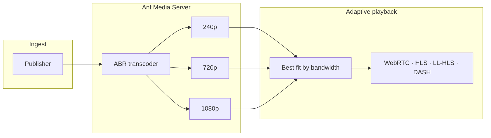

# Adaptive Bitrate Streaming

**Adaptive Bitrate (ABR)** takes one live publish and creates several quality versions—the same stream at different resolutions and bitrates (for example 240p, 720p, and 1080p). Each viewer gets the rendition that fits their network. Quality switches automatically; no manual selection is required.

**Ant Media Server** supports ABR on **WebRTC**, **HLS**, **LL-HLS**, and **CMAF (DASH)**. On WebRTC, the server picks the best rendition from live connection stats. On HLS, LL-HLS, and DASH, the player adapts using the multi-bitrate playlist or manifest.

## How ABR works

One publisher sends a single stream. The server transcodes it into an ABR ladder; each viewer plays the rendition that matches their connection.



The server or player switches renditions automatically as network conditions change.

## Why use ABR

Without multiple renditions, viewers on slow or unstable networks may buffer, stall, or drop off. ABR gives each client a fallback when bandwidth drops while still offering higher quality when the connection allows it.


## Supported playback protocols

| Protocol | ABR behavior |
|----------|--------------|
| **WebRTC** | Server monitors viewer stats and switches renditions when [stats-based ABR](#stats-based-adaptive-bitrate-switching) is enabled. |
| **HLS** | Player reads the master playlist and requests the variant that fits available bandwidth. |
| **LL-HLS** | Same adaptive playlist model as HLS, with low-latency segment delivery. |
| **CMAF (DASH)** | Player selects the appropriate DASH/CMAF representation from the multi-bitrate manifest. |

## Enable ABR in application settings

1. Open **Applications → your app → Settings → Adaptive Streaming** in the web panel.
2. Enable adaptive streaming and add the resolutions and bitrates you need.


3. Save settings.
4. Start new streams or restart streams that were already publishing.

These settings apply to **every stream** in the application unless you override them at broadcast level (below).

## Per-broadcast ABR (REST API)

From **Ant Media Server 2.8.3**, set ABR profiles on individual broadcasts with [createBroadcast](https://antmedia.io/rest/#/default/createBroadcast) or [updateBroadcast](https://antmedia.io/rest/#/default/updateBroadcast)—before or while the stream is live.

:::tip When to use per-broadcast ABR
**Selective transcoding** — Many streams publish to the same app, but only some need ABR. Add `encoderSettingsList` on those broadcasts and leave the rest without it to save CPU.

**Different ladder per stream** — Use a 1080p / 720p / 480p ladder for a main event and a lighter 480p / 240p ladder for a secondary feed, all within one application.
:::

The example below gives stream ID `test` three renditions. Other streams in the app keep the default app-level ABR (or none):

```bash
curl --location 'https://domainName:5443/live/rest/v2/broadcasts/create' \
--header 'Content-Type: application/json' \
--data '{ "name": "test",
  "streamId": "test",
  "encoderSettingsList": [
    {"videoBitrate": 500000, "forceEncode": true, "audioBitrate": 32000, "height": 240},
    {"videoBitrate": 2000000, "forceEncode": true, "audioBitrate": 128000, "height": 720},
    {"videoBitrate": 2500000, "forceEncode": true, "audioBitrate": 256000, "height": 1080}
  ]
}'
```

:::info
Each entry in `encoderSettingsList` defines one rendition:

- `height` — vertical resolution (for example `240` = 240p)
- `videoBitrate` — target video bitrate in bits per second
- `audioBitrate` — target audio bitrate in bits per second
- `forceEncode` — transcode even when the source already matches this height (see [Force Encode](/guides/adaptive-bitrate/forceencode/))
:::

## Stats-based adaptive bitrate switching

From **Ant Media Server 2.6.0**, **stats-based ABR** adjusts WebRTC playback from live bandwidth stats. By default:

```js
"statsBasedABREnabled": true
```

When enabled, WebRTC viewers receive the best matching rendition without manual quality selection.

The server monitors network stats during the session and switches between profiles (for example 720p → 480p) to keep playback smooth.

## Include the original stream in HLS playlists

For **HLS**, `addOriginalMuxerIntoHLSPlaylist` controls whether the **incoming** publish resolution is listed in the master playlist alongside transcoded renditions. Default:

```js
"addOriginalMuxerIntoHLSPlaylist": true
```

**When `true`:** the original publish resolution is listed in the master playlist together with all ABR renditions. For example, a 720p source with 480p and 240p profiles can offer **720p** (original), **480p**, and **240p** in the playlist.

**When `false`:** only transcoded renditions appear. The same example would list **480p** and **240p** only.

:::warning Original vs transcoded encoding
The original mux often uses different keyframe interval or other encoding parameters than transcoded renditions. That mismatch can cause playback or quality-switching issues in HLS.

If you see such problems, set `addOriginalMuxerIntoHLSPlaylist` to `false` and add the resolutions you need as ABR profiles so every playlist entry is transcoded with consistent settings.
:::

## Best practices

- Define at least **two or three** renditions so viewers have a fallback on weak networks.
- Use **GPU acceleration** when transcoding many profiles—see [Enable GPU for Ant Media Server](/guides/advanced-usage/using-nvidia-gpu/).
- Monitor viewer bandwidth and CPU load, then tune bitrates and ladder steps.
- Use **per-broadcast ABR** when only some streams in an app need transcoding or when ladders differ by stream.

For manual quality selection by viewers or apps, see [Enforce Stream Quality](/guides/adaptive-bitrate/enforcing-stream-quality/). For preview images tied to ABR, see [Thumbnails](/guides/adaptive-bitrate/generating-thumbnails/).
