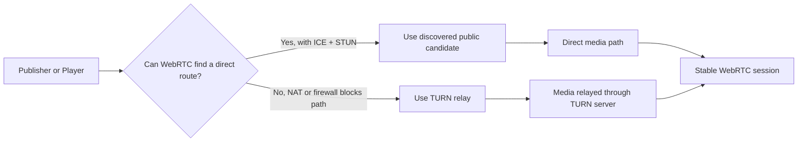

# STUN/TURN Server Configuration

Use custom **STUN** and **TURN** servers when the default ICE setup is not enough for your network topology, especially in **AWS Wavelength Zones** or strict NAT and firewall environments.

## How STUN and TURN help

When a publisher or player starts a WebRTC session, it must gather reachable network candidates. STUN helps discover public-facing addresses. If a direct peer path still cannot be established, TURN relays media through a server.



## What you'll accomplish

By the end of this guide, you will:

1. Replace the default STUN server for AWS Wavelength deployments.
2. Configure a TURN server in Ant Media Server so clients can reuse it automatically.
3. Add STUN/TURN servers manually in JavaScript, Embedded Player, Android, iOS, and Flutter clients when needed.

## When to use each option

- Use the default Google STUN server for most standard deployments.
- Use a custom **STUN** server when ICE candidate discovery needs a region-specific or private setup, such as **AWS Wavelength Zones**.
- Use a **TURN** server when WebRTC still fails after STUN because the client is behind a strict NAT, firewall, or symmetric NAT.

## Custom STUN servers for AWS Wavelength Zones

In most deployments, the default Google STUN server is sufficient, so you do not need to change anything.

AWS Wavelength Zones can have limitations when gathering ICE candidates. For this case, Ant Media provides a publicly accessible STUN endpoint:

```text
stun:stun.wavelength.antmedia.cloud
```

### Step 1: Configure the custom STUN server in Ant Media Server

1. Open the Ant Media Server dashboard.
2. Go to `Application -> Settings -> Advanced Settings`.
3. Change:

```properties
stunServerURI=stun:stun1.l.google.com:19302
```

to:

```properties
stunServerURI=stun:stun.wavelength.antmedia.cloud
```

4. Save the application settings.

If you configure STUN/TURN on the server side, clients that use those application settings usually do not need separate STUN configuration.

### Step 2: Configure the custom STUN server on the client side

If you cannot rely on server-side settings alone, add the STUN server directly as an ICE server in the client SDK.

#### JavaScript SDK

Pass the STUN server in the `iceServers` array inside `peerconnection_config`.

Default example:

```js
var pc_config = {
  iceServers: [
    {
      urls: "stun:stun1.l.google.com:19302",
    },
  ],
};

var webRTCAdaptor = new WebRTCAdaptor({
  websocket_url: websocketURL,
  mediaConstraints: mediaConstraints,
  peerconnection_config: pc_config,
  // other options
});
```

Replace the STUN URL with:

```js
var pc_config = {
  iceServers: [
    {
      urls: "stun:stun.wavelength.antmedia.cloud",
    },
  ],
};
```

#### Ant Media sample publish/play pages

If you are using the sample pages under `/usr/local/antmedia/webapps/live`:

1. Open the relevant HTML file.
2. Find:

```js
var pc_config = {
  iceServers: [
    {
      urls: "stun:stun1.l.google.com:19302",
    },
  ],
};
```

3. Replace it with:

```js
var pc_config = {
  iceServers: [
    {
      urls: "stun:stun.wavelength.antmedia.cloud",
    },
  ],
};
```

4. Save the file. You do not need to restart Ant Media Server.

## Custom TURN server

If WebRTC connectivity still fails even after STUN is configured correctly, you may need a TURN relay server. For TURN installation, see [Coturn Quick Installation](/guides/advanced-usage/turn-installation/coturn-quick-installation/).

TURN extends STUN by relaying traffic when direct connectivity cannot be established.

### Step 1: Configure the TURN server in Ant Media Server

You can configure TURN directly in Ant Media Server so client SDKs do not need separate TURN setup in most cases.

:::info
If server-side TURN configuration does not solve connectivity for a specific client, add the TURN server manually to that client’s ICE server list.
:::

1. Open the Ant Media Server dashboard.
2. Go to `Application -> Settings -> Advanced Settings`.
3. Set:

```properties
stunServerURI=turn:TYPE_YOUR_TURN_SERVER_URL
turnServerUsername=TYPE_YOUR_TURN_SERVER_USERNAME
turnServerCredential=TYPE_YOUR_TURN_SERVER_PASSWORD
```

4. Save the settings.

Ant Media Server will then use your TURN server for that application.

### Step 2: Configure the TURN server in client SDKs

#### JavaScript SDK

```js
var pc_config = {
  iceServers: [
    {
      urls: "stun:stun1.l.google.com:19302",
    },
    {
      urls: "turn:TURN_IP:3478",
      username: "username",
      credential: "password",
    },
  ],
};

var webRTCAdaptor = new WebRTCAdaptor({
  peerconnection_config: pc_config,
  // other options
});
```

#### Embedded Player

If you are using the Ant Media Embedded Web Player from the [Web Player repository](https://github.com/ant-media/Web-Player), pass `iceServers` as a string to the `WebPlayer` constructor.

```js
new WebPlayer(
  {
    streamId: "teststream",
    httpBaseURL: "http://localhost:5080/live/",
    iceServers: `[
      { "urls": "stun:stun1.l.google.com:19302" },
      {
        "urls": "turn:TURN_IP:3478",
        "username": "username",
        "credential": "password"
      }
    ]`,
    videoHTMLContent:
      '<video id="video-player" class="video-js vjs-default-skin vjs-big-play-centered" controls playsinline style="width:100%;height:100%"></video>',
    playOrder: playOrderLocal,
  },
  videoRef.current,
  placeHolderRef.current
);
```

If you are using the Ant Media sample `play.html` page, remember that it is based on the embedded web player.

Edit:

```text
/usr/local/antmedia/webapps/live/webapps/js/embedded-player.js
```

Change:

```js
this.iceServers = '[ { "urls": "stun:stun1.l.google.com:19302" } ]';
```

to:

```js
this.iceServers =
  '[ { "urls": "turn:TURN_IP:3478", "username": "username", "credential": "password" } ]';
```

For more details, see [Embedded Web Player](/guides/playing-live-stream/embedded-web-player/#ant-media-server-web-player).

#### Android SDK

Use `setTurnServer()` in the Android SDK builder:

```java
webRTCClient = IWebRTCClient.builder()
    .setLocalVideoRenderer(fullScreenRenderer)
    .setServerUrl(serverUrl)
    .setTurnServer("turn:YOUR_SERVER", "username", "password")
    .setActivity(this)
    .setWebRTCListener(createWebRTCListener())
    .setDataChannelObserver(createDatachannelObserver())
    .build();
```

If you use the Android SDK as a module and want to add TURN directly to the ICE list, update the `init()` function in `WebRTCClient.java`.

Replace:

```java
iceServers.add(new PeerConnection.IceServer(stunServerUri));
```

with:

```java
iceServers.add(
    PeerConnection.IceServer.builder("turn:YOUR_SERVER")
        .setUsername("username")
        .setPassword("credential")
        .createIceServer()
);
```

#### iOS SDK

Open `Config.swift` and update the configuration so the TURN server is added to the ICE list.

```swift
static func createConfiguration(server: RTCIceServer) -> RTCConfiguration {
    let config = RTCConfiguration()
    let turnServer = RTCIceServer(
        urlStrings: ["turn:YOUR_SERVER"],
        username: "your_username",
        credential: "your_password"
    )
    config.iceServers = [server, turnServer]
    return config
}
```

#### Flutter SDK

```dart
List<Map<String, String>> iceServers = [
  {"url": "stun:stun.l.google.com:19302"},
  {
    "urls": "turn:TURN_IP:3478",
    "username": "username",
    "credential": "password"
  }
];

AntMediaFlutter.connect(
  // other options
  widget.iceServers,
);
```

## Result

After you configure the right STUN or TURN server, WebRTC sessions can gather usable ICE candidates more reliably and recover from restrictive network environments such as Wavelength Zones, office firewalls, and carrier-grade NATs.

## Troubleshooting

| Symptom | What to check |
| --- | --- |
| No ICE candidates appear | Confirm `stunServerURI` is valid and reachable; verify there are no typos in the STUN URL. |
| WebRTC connects on one network but not another | The failing network may require TURN instead of STUN; test with a TURN relay configured. |
| TURN is configured but media still does not flow | Check TURN username, credential, and port; confirm the TURN server allows relay traffic and is reachable from clients. |
| JavaScript sample pages still use Google STUN | Update the local `pc_config` or `embedded-player.js` file in the sample app. |
| Wavelength deployment still fails after STUN change | Verify you used `stun:stun.wavelength.antmedia.cloud` exactly and saved the application settings. |
