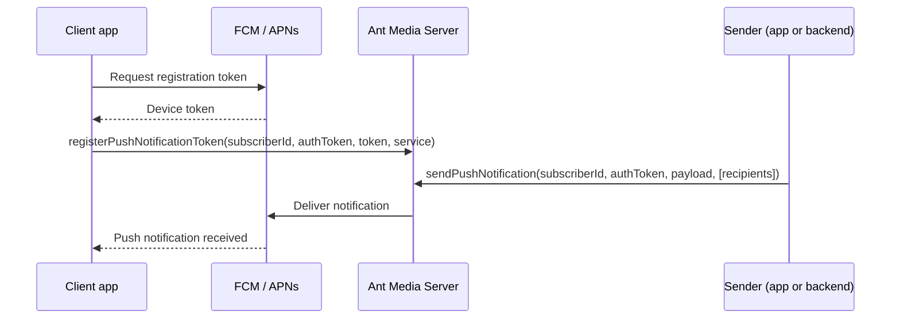

# Push Notifications

Push notifications let Ant Media Server reach users when they are not actively connected to a stream — for incoming video calls, live event alerts, or custom messages tied to your WebRTC application.

## What are push notifications?

A push notification is a message delivered to a client device through a platform notification service, even when your app is in the background or closed. Ant Media Server integrates with:

| Platform | Service | Typical clients |
|----------|---------|-----------------|
| **Android & Web** | [Firebase Cloud Messaging (FCM)](https://firebase.google.com/docs/cloud-messaging) | Android apps, browser clients |
| **iOS** | [Apple Push Notification service (APNs)](https://developer.apple.com/documentation/usernotifications) | iPhone and iPad apps |

Each device receives a unique **registration token** from FCM or APNs. Your client registers that token with Ant Media Server, linked to a **subscriber ID**. When an event occurs — such as an incoming call — your backend or another client asks AMS to send a notification to that subscriber.

## Common use cases

| Use case | How AMS helps |
|----------|---------------|
| **Incoming video/audio calls** | Wake the callee's app and show an Accept/Decline notification |
| **Live stream alerts** | Notify followers when a broadcaster goes live |
| **Conference invitations** | Alert participants to join a room |
| **Custom app events** | Send arbitrary JSON payloads with titles and metadata |

Push notifications complement [Webhooks](/guides/developer-sdk-and-api/webhooks/) and the [REST API](/guides/developer-sdk-and-api/rest-api-guide/): webhooks notify your backend of server events; push notifications reach end-user devices in real time.

## How it works

1. Configure FCM and/or APNs credentials in the AMS application settings.
2. Each client obtains a device token and registers it with AMS using a subscriber ID.
3. A sender calls `sendPushNotification` (via WebSocket) or the REST API to deliver a message to one or more subscribers.
4. AMS routes the notification through FCM or APNs to the target device.

Subscriber authentication tokens protect register and send operations. See [Server Setup](/guides/developer-sdk-and-api/push-notification-management/server-setup/) for configuration details.

## What you'll find in this section

| Guide | Description |
|-------|-------------|
| [Server Setup](/guides/developer-sdk-and-api/push-notification-management/server-setup/) | Upload FCM/APNs credentials, generate auth tokens |
| [Send Notifications](/guides/developer-sdk-and-api/push-notification-management/send-notifications/) | Register tokens and send messages via WebRTCAdaptor |
| [Android](/guides/developer-sdk-and-api/push-notification-management/android/setup-firebase/) | Firebase setup, SDK dependencies, notification handlers |
| [iOS](/guides/developer-sdk-and-api/push-notification-management/ios/prerequisites/) | APNs keys, Xcode configuration, Firebase Messaging |

## Integration path

1. [Configure the server](/guides/developer-sdk-and-api/push-notification-management/server-setup/) — upload FCM JSON or APNs `.p8` key in application settings
2. Set up your platform — follow the [Android](/guides/developer-sdk-and-api/push-notification-management/android/setup-firebase/) or [iOS](/guides/developer-sdk-and-api/push-notification-management/ios/prerequisites/) guide
3. [Register tokens and send](/guides/developer-sdk-and-api/push-notification-management/send-notifications/) — use `WebRTCAdaptor` from the [JavaScript SDK](/guides/developer-sdk-and-api/sdk-integration/javascript-sdk/) or native SDK clients

:::info
Push notifications require a physical device for testing on iOS. The iOS Simulator does not support APNs delivery.
:::
