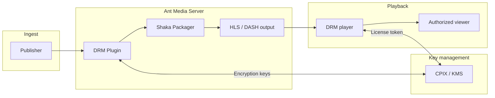

# DRM Plugin for Ant Media Server

Protect live and on-demand streams with **Digital Rights Management (DRM)**. The DRM Plugin integrates Ant Media Server with your key management service through the **CPIX (Content Protection Information Exchange) API**, encrypting **HLS** and **DASH** output so only authorized viewers can play your content.

Supported DRM systems:

| Platform | DRM system |
|----------|------------|
| Chrome, Android, Firefox | **Widevine** |
| Safari, iOS, tvOS | **FairPlay** |
| Edge, Smart TVs, Xbox | **PlayReady** |

## What you'll accomplish

By the end of this guide, you will:

1. Install the DRM Plugin and Shaka Packager on your Ant Media Server.
2. Connect the plugin to a CPIX-compatible key management service.
3. Publish a live stream and confirm encrypted manifests are generated.
4. Play the stream in a DRM-enabled player and verify protection is active.

## How DRM works with Ant Media Server

When a stream is published, the DRM Plugin requests encryption keys from your **Key Management Server (KMS)**, packages segments with **Shaka Packager**, and serves protected **HLS** and **DASH** manifests. Viewers need a license token from your DRM provider before playback can start.

The diagram below shows the main components and how they connect:



Encryption keys are fetched when the stream is packaged. At playback, the DRM player validates a license with the same KMS before decrypting the stream.

## Prerequisites

Before you begin, confirm the following:

- Ant Media Server is installed and running.
- You have a valid [DRM Plugin subscription](https://antmedia.io/product/drm-plugin/).
- You have shell access to the server (`sudo` for file operations).
- You use a CPIX-compatible DRM provider (this guide uses **DoveRunner** as an example; other providers work with the same `keyManagementServerURL` pattern).

:::info
Need the plugin? [Purchase the DRM Plugin](https://antmedia.io/product/drm-plugin/) or email contact@antmedia.io.
:::

## Step 1: Install the DRM Plugin

1. Download **DRM-Plugin-bundle.jar** after purchase.
2. Copy the JAR into the Ant Media Server plugins directory:

   ```bash
   sudo cp DRM-Plugin-bundle.jar /usr/local/antmedia/plugins/
   ```

3. Restart Ant Media Server to load the plugin:

   ```bash
   sudo service antmedia restart
   ```

The plugin is active after restart. No additional enable flag is required beyond the configuration in the next section.

## Step 2: Install Shaka Packager

Shaka Packager encrypts media segments and builds DRM-ready manifests. Install it once on the server:

1. Download the binary:

   ```bash
   wget https://github.com/shaka-project/shaka-packager/releases/download/v3.4.1/packager-linux-x64 -O shakapackager
   ```

2. Move it to your PATH and make it executable:

   ```bash
   sudo cp shakapackager /usr/local/bin/
   sudo chmod +x /usr/local/bin/shakapackager
   ```

3. Confirm it runs:

   ```bash
   shakapackager --version
   ```

## Step 3: Configure the DRM Plugin

DRM settings live under **`customSettings`** in your application configuration.

1. Open the Ant Media Server web panel.
2. Select your application on the left (for example, `live` or `WebRTCAppEE`).
3. Go to **Settings → Advanced**.
4. Locate **`customSettings`** and add the DRM plugin block.

### Minimal configuration

```json
"customSettings": {
  "plugin.drm-plugin": {
    "enabledDRMSystems": [
      "Widevine"
    ],
    "keyManagementServerURL": "{KMS_URL}"
  }
}
```

### Multiple DRM systems

Enable more than one system in the same application:

```json
"enabledDRMSystems": [
  "Widevine",
  "PlayReady"
]
```

:::tip FairPlay and encryption scheme
Use **`cbcs`** (default) when FairPlay is enabled. The **`cenc`** scheme does not support FairPlay.
:::

5. Save the settings.

### Configuration reference

| Field | Required | Description |
|-------|----------|-------------|
| **`keyManagementServerURL`** | Yes | CPIX endpoint URL from your DRM provider. |
| **`enabledDRMSystems`** | Yes | Array of `"Widevine"`, `"FairPlay"`, and/or `"PlayReady"`. |
| **`encryptionScheme`** | No | `"cbcs"` (default) or `"cenc"`. |
| **`hlsPlayListType`** | No | `"LIVE"` (default), `"VOD"`, or `"EVENT"`. |
| **`segmentDurationSecs`** | No | Segment length in seconds. Default: `2`. |
| **`timeShiftBufferDepthSecs`** | No | Live buffer depth. Default: `60`. |
| **`segmentsOutsideLiveWindow`** | No | Extra segments outside the live window. Default: `5`. |

## Step 4: Connect DoveRunner (Widevine example)

This section walks through a complete **Widevine** setup with [DoveRunner](https://doverunner.com/). Replace provider-specific values if you use a different KMS.

### 4.1 Get your KMS URL

1. Log in to the [DoveRunner Web Panel](https://contentsecurity.doverunner.com/).
2. Go to [Multi-DRM → DRM Settings](https://contentsecurity.doverunner.com/drm/setting).
3. Copy your **KMS Token**.
4. Build the CPIX URL:

   ```text
   https://kms.pallycon.com/v2/cpix/pallycon/getKey/{YOUR_KMS_TOKEN}
   ```

5. Update `customSettings` in the Ant Media Server web panel:

   ```json
   "plugin.drm-plugin": {
     "enabledDRMSystems": [
       "Widevine"
     ],
     "keyManagementServerURL": "https://kms.pallycon.com/v2/cpix/pallycon/getKey/{YOUR_KMS_TOKEN}"
   }
   ```

6. Save the settings.

### 4.2 Set up a DRM-enabled player

Clone DoveRunner's sample HTML5 player and copy it into your application web directory. Replace `{YOUR_APP}` with your application name (for example, `live`):

```bash
git clone https://github.com/doverunner/html5-player-drm-samples
cd html5-player-drm-samples
sudo cp basic/videojs/index.html /usr/local/antmedia/webapps/{YOUR_APP}/videojs-doverunner-sample.html
sudo cp basic/videojs/js/videojs-sample.js /usr/local/antmedia/webapps/{YOUR_APP}/js/
sudo cp shared/js/doverunner-base-helper.js /usr/local/antmedia/webapps/{YOUR_APP}/js/
sudo cp css/* /usr/local/antmedia/webapps/{YOUR_APP}/css/
```

Fix relative paths in the sample HTML file:

```bash
sudo sed -i 's|\.\./\.\./css/|./css/|g; s|\.\./\.\./shared/js/|./js/|g; s|\.\./\.\./media/|./media/|g' \
  /usr/local/antmedia/webapps/{YOUR_APP}/videojs-doverunner-sample.html
```

Confirm the player page exists:

```bash
ls -la /usr/local/antmedia/webapps/{YOUR_APP}/videojs-doverunner-sample.html
```

## Step 5: Publish and verify encrypted output

1. Publish a **WebRTC** stream from Chrome using the sample publish page. See the [WebRTC Publish guide](/guides/publish-live-stream/webrtc/).
2. Use a clear **stream ID** — for example, `stream007`.
3. After publishing starts, check that encrypted manifests were created:

   ```bash
   sudo ls /usr/local/antmedia/webapps/{YOUR_APP}/streams/drm/stream007/
   ```

   You should see **`master.mpd`** and **`master.m3u8`**. These files confirm the DRM Plugin is packaging encrypted output.

4. Note your playback URLs (replace `{YOUR_ANTMEDIA_SERVER}` and `{YOUR_APP}`):

   ```text
   DASH: https://{YOUR_ANTMEDIA_SERVER}:5443/{YOUR_APP}/streams/drm/stream007/master.mpd
   HLS:  https://{YOUR_ANTMEDIA_SERVER}:5443/{YOUR_APP}/streams/drm/stream007/master.m3u8
   ```

:::info
Manifests appear under `streams/drm/{streamId}/` only after the stream is live and the plugin has retrieved keys from your KMS.
:::

## Step 6: Generate a license token and play

DRM playback requires a **license token** tied to the stream and viewer.

1. Open the [DoveRunner Token Generator](https://devconsole.doverunner.com/drm-tools/license-token/#token-generator).
2. Enter:
   - **SITE ID, SITE Key, ACCESS Key** — from [DoveRunner DRM Settings](https://contentsecurity.doverunner.com/drm/setting).
   - **DRM Type** — `Widevine`.
   - **CID** — your stream ID (for example, `stream007`).
   - **USER ID** — any unique viewer identifier (for example, `1234`).
3. Click **Refresh Timestamp**, then **Generate Token**, and copy the result.
4. Edit the player helper file:

   ```bash
   sudo nano /usr/local/antmedia/webapps/{YOUR_APP}/js/doverunner-base-helper.js
   ```

   Set your DASH manifest URL and token:

   ```js
   dashUri = "https://{YOUR_ANTMEDIA_SERVER}:5443/{YOUR_APP}/streams/drm/stream007/master.mpd";
   widevineToken = '{PASTE_YOUR_GENERATED_TOKEN_HERE}';
   ```

5. Save and exit.

6. Open the sample player in **Chrome** (Widevine support):

   ```text
   https://{YOUR_ANTMEDIA_SERVER}:5443/{YOUR_APP}/videojs-doverunner-sample.html
   ```

7. Click **Play**. The stream should start with DRM-protected Widevine playback.

### Confirm DRM is active

Take a screenshot while the video is playing. If DRM encryption is working, the captured video area is typically **blank or black** — that means content is protected from unauthorized capture.


The screenshot above shows DRM protection in action: playback works for authorized viewers, but the video frame cannot be captured.

---

## Troubleshooting

| Symptom | What to check |
|---------|----------------|
| No `master.mpd` / `master.m3u8` | Plugin JAR present in `/usr/local/antmedia/plugins/`, server restarted, valid `keyManagementServerURL`, stream is publishing. |
| Playback fails immediately | License token matches stream ID (CID), token not expired, correct DRM type selected. |
| Shaka Packager errors | Binary is executable at `/usr/local/bin/shakapackager` and on the server PATH. |
| FairPlay not working | Use `"cbcs"` encryption scheme and include `"FairPlay"` in `enabledDRMSystems`. |

For plugin architecture details, see [Plugins for Ant Media Server](/guides/developer-sdk-and-api/extend-the-server/plugins/plugins-for-ant-media-server/#drm-plugin).
