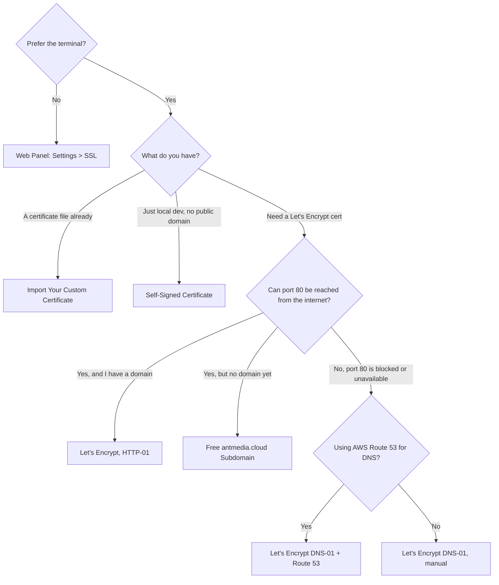

# How to Enable SSL

SSL is mandatory for secure access to the camera and microphone in the browser, and for WebSocket Secure (WSS) connections in WebRTC — most modern browsers require it. AMS offers several ways to get an SSL certificate; use this to find the one that fits your situation:



## Option 1: Enabling SSL from the Web Panel

In previous versions, configuring SSL involved intricate steps, such as accessing the server through SSH and executing the `enable_ssl.sh` script from the installation directory `/usr/local/antmedia`.

However, starting with AMS version 2.6.2, this process is streamlined so you can enable SSL directly from the AMS Web Panel.

- After [installing AMS](/guides/installing-on-linux/installing-ams-on-linux/), log in to the web panel and navigate to `SETTINGS > SSL`.


- In the drop-down select box named Type, choose among the various options to enable SSL, like [using your own domain](#create-lets-encrypt-certificate-with-http-01-challenge), [free subdomain of antmedia.cloud](#get-a-free-subdomain-and-install-ssl-with-lets-encrypt), or [import your own certificate](#import-your-custom-certificate), and then click Activate to enable SSL and restart your server.


- This will start to enable SSL for AMS.


- The AMS instance will restart and the server can now be accessed securely with SSL enabled.


## Option 2: Installing SSL using the Terminal

Apart from the web panel, SSL for AMS can also be installed using the terminal, and there are a number of ways to do it depending on your specific use case and requirements.

:::info
Every method below that requests a new Let's Encrypt certificate — everything except importing your own certificate — needs port 80 free on the server (nothing else listening on it), even the DNS-01 methods that don't need port 80 open to the internet. `enable_ssl.sh` checks this and exits if something else, like Apache or Nginx, is already using it. Stop or disable that service first, for example: `sudo service apache2 stop`.
:::

### Get a free subdomain and install SSL with Let's Encrypt

If you do not have a domain name and want to install an SSL certificate, you can use this feature. With this feature, **enterprise users** will have a free domain name with the extension **ams-[id].antmedia.cloud**, and the Let's Encrypt certificate will be automatically installed. This feature is available in versions after 2.5.2.

**Requirements:** a valid Enterprise license key already configured on the server (the script checks for it and exits without one), a static/fixed public IP address, and port 80 reachable from the internet — this method validates the certificate the same way HTTP-01 does.

:::info
If you want to use the free sub-domain from `antmedia.cloud`, make sure your server has a static/fixed IP address so the domain can be mapped to it.

If the IP is dynamic and changes, the server will no longer be accessible on a previously generated sub-domain.
:::

- Go to the folder where AMS is installed. The default directory is `/usr/local/antmedia`

```shell
cd /usr/local/antmedia
```
- Run the `enable_ssl.sh` command to install the SSL.

```shell
sudo ./enable_ssl.sh
```

### Create Let's Encrypt certificate with HTTP-01 challenge

The script in this document installs a **Let's Encrypt** SSL certificate.

**Requirements:** a domain with an `A` record pointing to your server's public IP, and port 80 reachable from the internet — Let's Encrypt connects to your server on port 80 to validate the domain.

First, create an `A` record for your domain name in your DNS records. This way, your domain name will be resolved to your server's public IP address. Note that this guide is for Ubuntu systems, but there are several guides on the internet for other Linux distributions as well.

- If there is a service that uses port 80, you need to disable it first. For example, if your system has Apache web server, you need to disable it using:

  ```bash
  sudo service apache2 stop
  ```

- Go to the folder where AMS is installed. The default directory is `/usr/local/antmedia`

  ```bash
  cd /usr/local/antmedia
  ```

- Run the `enable_ssl.sh` command to install the SSL.

  ```bash
  sudo ./enable_ssl.sh -d example.com
  ```

### Self-Signed Certificate (Local Development)

If you're developing locally and don't have a public domain yet, a self-signed certificate lets you enable HTTPS/WSS on `localhost` or your local network so you can test camera/microphone access and WebRTC without waiting on a real certificate.

**Requirements:** just OpenSSL. No domain, no static IP, and no port 80 — this is one of the few options that doesn't need it, since nothing is validated over the internet.

:::info
Browsers will show a security warning for self-signed certificates since they aren't issued by a trusted authority. This is expected — click through the warning (e.g. "Advanced" > "Proceed") to continue. Self-signed certificates are for local development only; use Let's Encrypt or your own certificate (above) for anything public-facing.
:::

1. Install OpenSSL if it isn't already available:

    ```bash
    apt-get update && apt-get install openssl -y
    ```

2. Generate a self-signed certificate and key:

    ```bash
    openssl req -newkey rsa:4096 -x509 -sha256 -days 3650 -nodes -out ams.crt -keyout ams.key
    ```

    You'll be prompted for certificate details. Any values work for local use, for example:

    ```
    Country Name (2 letter code) [AU]:UK
    State or Province Name (full name) [Some-State]:London
    Locality Name (eg, city) []:London
    Organization Name (eg, company) [Internet Widgits Pty Ltd]:Ant Media
    Organizational Unit Name (eg, section) []:Support
    Common Name (e.g. server FQDN or YOUR name) []:domain.com
    Email Address []: contact@antmedia.io
    ```

3. Enable SSL with the certificate you just created, replacing `<SERVER_IP>` with your server's IP address:

    ```bash
    sudo /usr/local/antmedia/enable_ssl.sh -f ams.crt -p ams.key -c ams.crt -d <SERVER_IP>
    ```

4. **Using a local domain name instead of an IP:** add an entry to `/etc/hosts` mapping your chosen domain to the server's IP:

    ```
    <SERVER_IP> domain.com
    ```

    Then re-run `enable_ssl.sh` with the domain name:

    ```bash
    sudo /usr/local/antmedia/enable_ssl.sh -f ams.crt -p ams.key -c ams.crt -d domain.com
    ```

Once this completes, your server is reachable over HTTPS/WSS at `https://<DOMAIN_OR_IP>:5443` for local development.

### Import your custom certificate

If you already have a certificate from your own provider, `enable_ssl.sh` can install it directly — no port 80 needed, since nothing is validated over the internet.

**Requirements:** all three files together — full chain, private key, and chain file. Providing only some of them is an error the script rejects. The file extensions (`.pem`, `.crt`, etc.) don't matter to the script, only the content.

```bash
sudo ./enable_ssl.sh -f <FULL_CHAIN_FILE> -p <PRIVATE_KEY_FILE> -c <CHAIN_FILE> -d <DOMAIN_NAME>
```

Example:

```bash
sudo ./enable_ssl.sh -f yourdomain.crt -p yourdomain.key -c yourdomainchain.crt -d yourdomain.com
```

:::info
**Known limitation:** your private key file must not be passphrase-protected. `enable_ssl.sh` passes it straight into `openssl` to build the server's keystore, without ever prompting for a passphrase — so an encrypted key will hang or fail. If your key has one, strip it first:

```bash
openssl rsa -in yourdomain.key -out yourdomain-nopass.key
```
:::

### Create Let's Encrypt certificate with DNS-01 challenge

In this method, there will be no HTTP requests back to your server, so port 80 doesn't need to be reachable from the internet (it still needs to be free locally — see the note above). This method is useful to create an SSL certificate in restricted environments, such as AWS Wavelength. This feature is available in versions after 2.4.0.2.

**Requirements:** access to add a TXT record with your DNS provider, and an interactive terminal session — the script pauses partway through and waits for you to create the record before continuing, so this isn't suitable for unattended or scripted runs.

Run `enable_ssl.sh` with `-v custom` as follows:

```bash
sudo ./enable_ssl.sh -d <DOMAIN_NAME> -v custom
```

The script will ask you to create a TXT record for your domain name, and print something like this:

```comments
- - - - - - - - - - - - - - - - - - - - - - - - - - - - - - - - - - - - - - - -
Please deploy a DNS TXT record under the name
_acme-challenge.subdomain.yourdomain.com with the following value:

ziB3UjMMSSO-La7jgqPXXXXeK-r2Ja80HluNJVvkg

Before continuing, verify the record is deployed.
- - - - - - - - - - - - - - - - - - - - - - - - - - - - - - - - - - - - - - - -
```

Create a TXT record in your DNS records as instructed above. For the sample above, we created a TXT **record _acme-challenge.subdomain.yourdomain.com** with the value **ziB3UjMMSSO-La7jgqPXXXXeK-r2Ja80HluNJVvkg**.

After you create the TXT record, press Enter to continue. The process should complete successfully if everything is set correctly.

### Create Let's Encrypt certificate with DNS-01 challenge and Route 53

Let's Encrypt has plugins to simplify authorization. The Route 53 plugin creates TXT records and deletes them after authorization is done. It's useful when creating instances in AWS Wavelength Zones, since the HTTP-01 challenge doesn't work there. Unlike the manual DNS-01 method above, this one is fully automated — no need to create the TXT record yourself or run it interactively.

**Requirements:** your domain hosted in Route 53, an IAM role with the policy below attached to the EC2 instance, and port 80 free locally (not required to be open to the internet — this method doesn't use HTTP-01).

- Create a policy (e.g., `dns-challenge-policy`) in the IAM service with the following content. [Check this out if you don't know how to create a policy](https://docs.aws.amazon.com/apigateway/latest/developerguide/api-gateway-create-and-attach-iam-policy.html).

```json
{
  "Version": "2012-10-17",
  "Id": "certbot-dns-route53 sample policy",
  "Statement": [
      {
          "Effect": "Allow",
          "Action": [
              "route53:ListHostedZones",
              "route53:GetChange"
          ],
          "Resource": [
              "*"
          ]
      },
      {
          "Effect" : "Allow",
          "Action" : [
              "route53:ChangeResourceRecordSets"
          ],
          "Resource" : [
              "arn:aws:route53:::hostedzone/*"
          ]
      }
  ]
}
```

- Create a Role (e.g., `dns-challenger`) in IAM for EC2 and attach the policy above to that role.
- Assign this role to the EC2 instance where you plan to install SSL.
- Create an `A` record for your domain name in Route 53 that resolves to your IP address.
- Run `enable_ssl.sh` as follows:

    ```bash
    sudo ./enable_ssl.sh -d <DOMAIN_NAME> -v route53
    ```

- If everything is set up properly, you can access the server via `https://<DOMAIN_NAME>:5443`

## Verify SSL Is Working

After running any of the methods above, confirm the certificate is actually in place:

```shell
curl -Iv https://<DOMAIN_NAME>:5443 2>&1 | grep -i "subject\|SSL certificate"
```

Or simply open `https://<DOMAIN_NAME>:5443` in a browser and check for the padlock icon. If the browser shows a certificate warning, double-check the domain matches what you issued the certificate for, and that the `enable_ssl.sh` command completed without errors.

## Need Help?

If SSL setup isn't working, reach out on [GitHub Discussions](https://github.com/orgs/ant-media/discussions) or contact [Technical Support](mailto:support@antmedia.io).

Once verified, you're ready to [publish a stream](/guides/publish-live-stream/webrtc/) or access the web panel securely over HTTPS.
