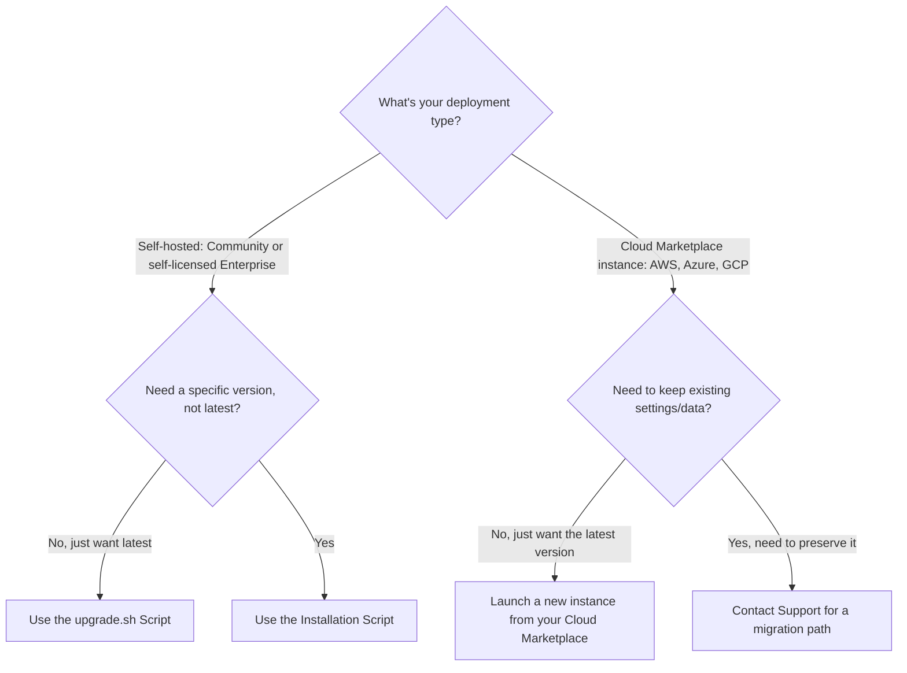

# Upgrade Ant Media Server

This guide explains how to upgrade Ant Media Server (AMS) from an earlier version to the latest version.

## Before You Begin

Make sure you have SSH access to your AMS instance with sudo/root privileges.

## Which Upgrade Method Should I Use?

The right method depends on your deployment type — most people are self-hosted and should use `upgrade.sh`:



- **[Self-hosted](#self-hosted-community-or-self-licensed-enterprise)** (this is most people) — use `upgrade.sh` for the latest version, or the installation script if you need a specific version instead.
- **[Cloud Marketplace instance](#cloud-marketplace-instances-aws-azure-gcp)** (AWS, Azure, GCP) — the scripts above won't work here; the path depends on whether you need to keep what's on the instance.

## Self-Hosted (Community or Self-Licensed Enterprise)

### Using the `upgrade.sh` Script

This is the one most people should use — it's a single command and detects your edition automatically.

:::info
This script is available under the installation directory (`/usr/local/antmedia`) for AMS version 2.9.0 and above. If you're on an older version, get the script from [GitHub](https://github.com/ant-media/Ant-Media-Server/blob/master/src/main/server/upgrade.sh) first and continue as below — you don't need to switch methods just because you're on an older version.
:::

1. SSH into your AMS instance.

2. Navigate to the installation directory:

   ```shell
   cd /usr/local/antmedia
   ```

3. Run the upgrade script:

   ```shell
   sudo ./upgrade.sh
   ```

The script checks your current version against the latest available, and downloads and installs the update if one is needed. It automatically detects whether you're on Community or Enterprise and upgrades accordingly — the same script works for both, and it preserves your existing settings and data as part of the upgrade. For more detail on what it does, see the [script source](https://github.com/ant-media/Ant-Media-Server/blob/master/src/main/server/upgrade.sh).

### Using the Installation Script

Use `install_ant-media-server.sh` instead if you want to install a specific version rather than whatever's latest.

First, get the zip file for the version you want:

- **Self-licensed Enterprise**: download it from the downloads section of your [antmedia.io account](https://antmedia.io/my-account/downloads/).
- **Community Edition**: download it from the [GitHub Releases page](https://github.com/ant-media/Ant-Media-Server/releases), which also lists the release notes for each version.

Then:

1. SSH into your AMS instance.

2. Download the installation script:

   ```shell
   wget -O install_ant-media-server.sh https://raw.githubusercontent.com/ant-media/Scripts/master/install_ant-media-server.sh && sudo chmod 755 install_ant-media-server.sh
   ```

3. Run it to upgrade, adding `-r true` if you want to keep your existing settings:

   ```shell
   sudo ./install_ant-media-server.sh -i <ANT_MEDIA_SERVER_ZIP_FILE> -r true
   ```

## Cloud Marketplace Instances (AWS, Azure, GCP)

`upgrade.sh` won't work here — verified directly against the script: it checks for a license key in your configuration, and if it can't find one but detects Enterprise plugin files (exactly the case on a Marketplace deployment, since your license is tied to the marketplace subscription rather than a license key), it exits and tells you to upgrade through your Cloud Marketplace instead. What that means in practice depends on whether you need to keep what's already on the instance:

- **Nothing to preserve** (no custom settings, streams, or data you need to keep): the simplest path is to launch a fresh instance from your Cloud Marketplace listing — it comes with the current version already installed. Point traffic at the new instance and decommission the old one once you've confirmed it's working.
- **Need to preserve your existing settings or data**: contact [Technical Support](mailto:support@antmedia.io) for a migration path. This is handled case by case rather than as a self-service script, since it depends on what's on your specific instance.

## Verify the Upgrade

For either self-hosted method, confirm the new version is actually running:

```shell
unzip -p /usr/local/antmedia/ant-media-server.jar | grep -a "Implementation-Version"
```

This prints the installed version — check it matches the version you expected to upgrade to.

## Restore a Previous Installation

Every time `install_ant-media-server.sh` installs over an existing AMS instance (which is what both self-hosted upgrade methods do under the hood), AMS automatically backs up the previous installation to a timestamped folder under `/usr/local`, for example `/usr/local/antmedia-backup-2026-07-28_10-42-54`.

To roll back to it:

```shell
sudo service antmedia stop
sudo rm -rf /usr/local/antmedia
sudo cp -p -R <BACKUP_FOLDER_PATH> /usr/local/antmedia
sudo chown -R antmedia:antmedia /usr/local/antmedia/
sudo service antmedia start
```

## Plugins After an Upgrade

A self-hosted upgrade moves your entire previous installation — plugins, their configurations, and license files included — into the backup folder described above, and replaces it with a fresh install that doesn't include them. To keep using your plugins, copy them back from the backup after upgrading:

```shell
sudo cp -r <BACKUP_FOLDER_PATH>/plugins/* /usr/local/antmedia/plugins/
sudo service antmedia restart
```

Our team is actively working on improving this process for future releases.

## Need Help?

If the upgrade doesn't go as expected, reach out on [GitHub Discussions](https://github.com/orgs/ant-media/discussions) or contact [Technical Support](mailto:support@antmedia.io).
