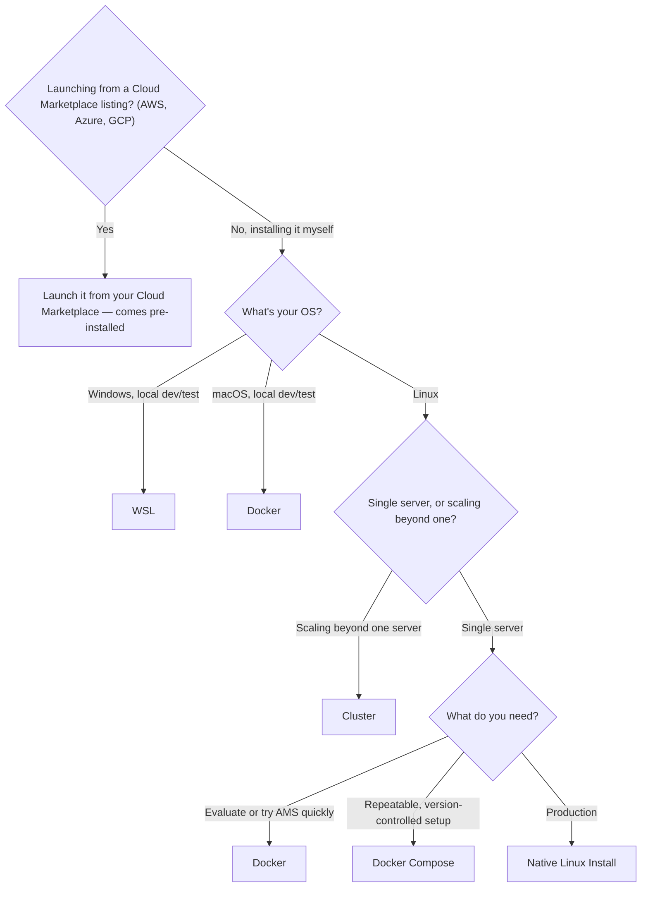

# Which Installation Method Should I Use?

Ant Media Server (AMS) can be installed several different ways. Use this to find your path before diving into a specific guide:

- **[Cloud Marketplace instance](#cloud-marketplace-instances)** (AWS, Azure, GCP) — if you're launching AMS from a Marketplace listing rather than installing it yourself, none of the methods below apply; it comes pre-installed.
- **[Native Install on Linux](/guides/installing-on-linux/installing-ams-on-linux/)** — the standard choice for a production server. Installs AMS directly as a systemd service. If you're not sure which to pick for production, start here.
- **[Docker](/guides/installing-on-linux/ams-docker-installation/)** — the fastest way to try AMS, to run it alongside other containerized services, or the only practical option for local development on **macOS** (there's no native Mac install).
- **[Docker Compose](/guides/installing-on-linux/ams-docker-compose-installation/)** — the same as Docker, but with your ports, volumes, and environment variables captured in one file so the setup is repeatable and easy to version-control.
- **[WSL (Windows Subsystem for Linux)](/guides/installing-on-linux/installing-ams-on-wls/)** — for local development and testing on a Windows machine. Not recommended for production.
- **[Cluster](/guides/clustering-and-scaling/manual-configuration/cluster-installation/)** — for scaling beyond what a single instance can handle. Worth setting up once you outgrow one server; see [Clustering & Scaling](/category/clustering-and-scaling/) to choose between the available clustering approaches.

If you're evaluating AMS or just getting started, Docker is usually the quickest path. For a production deployment, [Native Install on Linux](/guides/installing-on-linux/installing-ams-on-linux/) is the most common and best-supported route.

### Cloud Marketplace Instances

If you launched AMS from your Cloud Marketplace (AWS, Azure, GCP) rather than installing it yourself, it already comes with a version pre-installed — none of the install methods above apply, and you can skip straight to [publishing your first stream](/guides/publish-live-stream/webrtc/). See [Cloud Marketplace Instances](/guides/installing-on-linux/upgrading-ant-media-server/#cloud-marketplace-instances-aws-azure-gcp) in the upgrade guide for how these instances differ when it comes to updates.

## Once AMS Is Installed

- [Enable SSL](/guides/installing-on-linux/setting-up-ssl/) — required for camera/microphone access in the browser and for secure WebSocket connections.
- [Publish your first stream](/guides/publish-live-stream/webrtc/) to see it in action.
- [Upgrade Version](/guides/installing-on-linux/upgrading-ant-media-server/) or [Uninstall Ant Media Server](/guides/installing-on-linux/uninstall-ant-media-server-on-linux/) when you need to.
