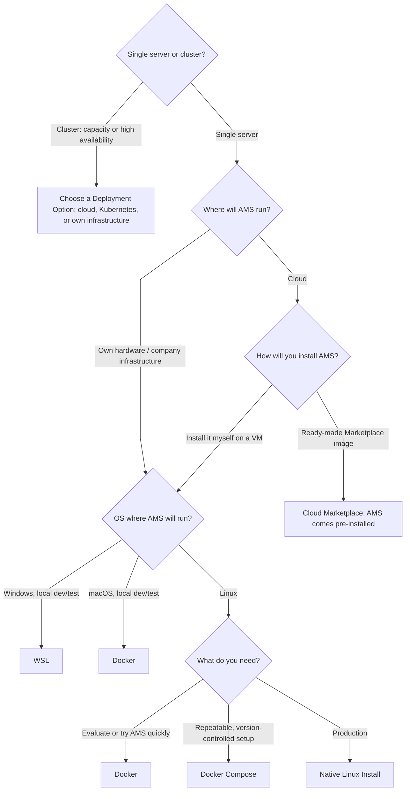

# Which Installation Method Should I Use?

First decide whether you need a **single server** or a **cluster** for capacity or high availability. Then choose where AMS will run and how you will install it.

For a single server, you can install AMS on **your own hardware**, install it on **a cloud VM you manage**, or launch a **ready-made Cloud Marketplace image**. The first two are self-hosted installations and use the same installation methods. A Marketplace image comes with AMS pre-installed in your cloud account; you still operate the server.

In the decision tree, the operating system is the one **where AMS will run**, not necessarily the one on your laptop. If you use a Mac to connect to a remote Linux server, follow the Linux path.

```mermaid
%%{init: {'flowchart': {'curve': 'linear', 'nodeSpacing': 80, 'rankSpacing': 80}}}%%
flowchart TD
    A{"Single server or cluster?"}
    A -->|"Cluster: capacity or high availability"| CLUSTER["Choose a Deployment Option: cloud, Kubernetes, or own infrastructure"]
    A -->|"Single server"| LOCATION{"Where will AMS run?"}
    LOCATION -->|"Own hardware / company infrastructure"| B{"OS where AMS will run?"}
    LOCATION -->|"Cloud"| METHOD{"How will you install AMS?"}
    METHOD -->|"Ready-made Marketplace image"| CM["Cloud Marketplace: AMS comes pre-installed"]
    METHOD -->|"Install it myself on a VM"| B
    B -->|"Windows, local dev/test"| WSL["WSL"]
    B -->|"macOS, local dev/test"| DOCKERMAC["Docker"]
    B -->|"Linux"| D{"What do you need?"}
    D -->|"Evaluate or try AMS quickly"| DOCKER["Docker"]
    D -->|"Repeatable, version-controlled setup"| COMPOSE["Docker Compose"]
    D -->|"Production"| NATIVE["Native Linux Install"]
```

- **[Cluster deployment options](/guides/clustering-and-scaling/choose-deployment-option/)** — choose a cloud, Kubernetes, or self-managed path when you need more capacity or high availability across nodes. This includes cloud Marketplace deployment options.
- **[Cloud Marketplace instance](#cloud-marketplace-instances)** (AWS, Azure, GCP) — if you're launching AMS from a Marketplace listing rather than installing it yourself, none of the methods below apply; it comes pre-installed.
- **[Native Install on Linux](/guides/installing-on-linux/installing-ams-on-linux/)** — the standard choice for a production server. Installs AMS directly as a systemd service. If you're not sure which to pick for production, start here.
- **[Docker](/guides/installing-on-linux/ams-docker-installation/)** — the fastest way to try AMS, to run it alongside other containerized services, or the only practical option for local development on **macOS** (there's no native Mac install).
- **[Docker Compose](/guides/installing-on-linux/ams-docker-compose-installation/)** — the same as Docker, but with your ports, volumes, and environment variables captured in one file so the setup is repeatable and easy to version-control.
- **[WSL (Windows Subsystem for Linux)](/guides/installing-on-linux/installing-ams-on-wls/)** — for local development and testing on a Windows machine. Not recommended for production.

If you're evaluating AMS or just getting started, Docker is usually the quickest path. For a production deployment, [Native Install on Linux](/guides/installing-on-linux/installing-ams-on-linux/) is the most common and best-supported route.

### Cloud Marketplace Instances

For a single instance, start with [Cloud marketplace installations](/quick-start/#cloud-marketplace-installations). If you already launched an AMS image from AWS, Azure, or GCP Marketplace, skip the installation commands, check the required ports, and continue with [SSL configuration](/guides/installing-on-linux/setting-up-ssl/) before [publishing your first stream](/guides/publish-live-stream/webrtc/). For a Marketplace-based cluster, use [Choose a Deployment Option](/guides/clustering-and-scaling/choose-deployment-option/). See [Cloud Marketplace Instances](/guides/installing-on-linux/upgrading-ant-media-server/#cloud-marketplace-instances-aws-azure-gcp) in the upgrade guide for how these instances differ when it comes to updates.

## Once AMS Is Installed

- [Enable SSL](/guides/installing-on-linux/setting-up-ssl/) — required for camera/microphone access in the browser and for secure WebSocket connections.
- [Publish your first stream](/guides/publish-live-stream/webrtc/) to see it in action.
- [Upgrade Version](/guides/installing-on-linux/upgrading-ant-media-server/) or [Uninstall Ant Media Server](/guides/installing-on-linux/uninstall-ant-media-server-on-linux/) when you need to.
