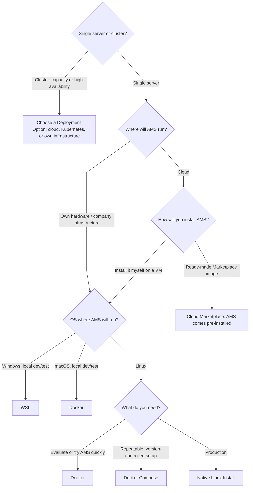

# Which Installation Method Should I Use?

Start by deciding whether you need a **single server** or a **cluster** for extra capacity or high availability. After that, pick where AMS will run and how you'll install it.

For a single server, you have three options: install AMS on **your own hardware**, install it on **a cloud VM you manage**, or launch a **ready-made Cloud Marketplace image**. The first two are both self-hosted and use the same installation methods. A Marketplace image comes with AMS already installed in your cloud account, but you still operate the server yourself.

When the decision tree asks about your operating system, it means the OS **where AMS will run**, not the one on your laptop. For example, if you use a Mac to connect to a remote Linux server, follow the Linux path.

```mermaid
%%{init: {'flowchart': {'curve': 'linear', 'nodeSpacing': 80, 'rankSpacing': 80}}}%%
flowchart TD
    A{"Single server or cluster?"}
    A -->|"Cluster: capacity or high availability"| CLUSTER["Choose a Deployment Option: cloud, Kubernetes, or own infrastructure"]
    A -->|"Single server"| LOCATION{"Where will AMS run?"}
    LOCATION -->|"Own hardware / company infrastructure"| B{"OS where AMS will run?"}
    LOCATION -->|"Cloud"| METHOD{"How will you install AMS?"}
    METHOD -->|"Ready-made Marketplace image"| CM["Cloud Marketplace: AMS comes pre-installed"]
    METHOD -->|"Install it myself on a VM"| B
    B -->|"Windows, local dev/test"| WSL["WSL"]
    B -->|"macOS, local dev/test"| DOCKERMAC["Docker"]
    B -->|"Linux"| D{"What do you need?"}
    D -->|"Evaluate or try AMS quickly"| DOCKER["Docker"]
    D -->|"Repeatable, version-controlled setup"| COMPOSE["Docker Compose"]
    D -->|"Production"| NATIVE["Native Linux Install"]
```

- **[Cluster deployment options](/guides/clustering-and-scaling/choose-deployment-option/):** use these when you need more capacity or high availability across several nodes. You can choose a cloud, Kubernetes, or self-managed setup, including Cloud Marketplace deployments.
- **[Cloud Marketplace instance](#cloud-marketplace-instances)** (AWS, Azure, GCP): AMS comes pre-installed, so you don't need any of the installation methods below.
- **[Native Install on Linux](/guides/installing-on-linux/installing-ams-on-linux/):** the standard choice for a production server. It installs AMS directly as a systemd service. If you're not sure what to use in production, start here.
- **[Docker](/guides/installing-on-linux/ams-docker-installation/):** the fastest way to try AMS or to run it alongside other containerized services. It's also the only practical option for local development on **macOS**, since there's no native Mac install.
- **[Docker Compose](/guides/installing-on-linux/ams-docker-compose-installation/):** the same as Docker, but your ports, volumes, and environment variables live in one file. That makes the setup repeatable and easy to keep under version control.
- **[WSL (Windows Subsystem for Linux)](/guides/installing-on-linux/installing-ams-on-wls/):** for local development and testing on a Windows machine. We don't recommend it for production.

If you're evaluating AMS or just getting started, Docker is usually the quickest way in. For production, [Native Install on Linux](/guides/installing-on-linux/installing-ams-on-linux/) is the most common and best-supported route.

## Cloud Marketplace Instances

For a single instance, start with [Cloud marketplace installations](/quick-start/#cloud-marketplace-installations) in the Quick Start.

If you've already launched an AMS image from the AWS, Azure, or GCP Marketplace, you can skip the installation commands. Check that the required ports are open, [set up SSL](/guides/installing-on-linux/setting-up-ssl/), and then [publish your first stream](/guides/publish-live-stream/webrtc/).

Planning a cluster on Marketplace images? See [Choose a Deployment Option](/guides/clustering-and-scaling/choose-deployment-option/). Marketplace instances also handle updates a little differently; see [Cloud Marketplace Instances](/guides/installing-on-linux/upgrading-ant-media-server/#cloud-marketplace-instances-aws-azure-gcp) in the upgrade guide for details.

## Once AMS Is Installed

- [Enable SSL](/guides/installing-on-linux/setting-up-ssl/). Browsers need it for camera and microphone access and for secure WebSocket connections.
- [Publish your first stream](/guides/publish-live-stream/webrtc/) to see AMS in action.
- When you need to, you can [upgrade to a newer version](/guides/installing-on-linux/upgrading-ant-media-server/) or [uninstall Ant Media Server](/guides/installing-on-linux/uninstall-ant-media-server-on-linux/).
