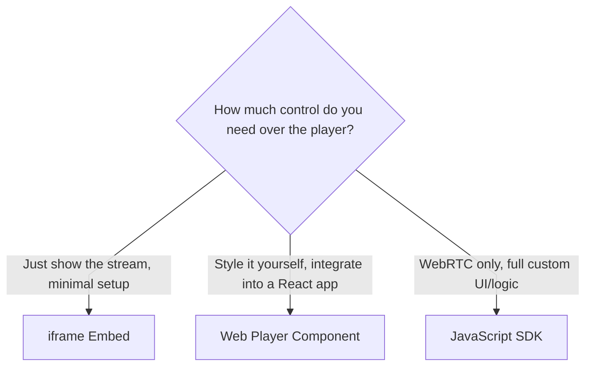

# Embedded Web Player

Ant Media Server ships with a ready-made video player, so you don't have to build one from scratch just to show a stream on your website. There are two ways to bring it in, depending on how much control you need.

By the end of this guide, you'll have a stream embedded in your own website, either via a quick `<iframe>` or the customizable Web Player component.



## Quick Embed with an Iframe

An iframe is the fastest way to get a stream onto your page — one line of HTML, no JavaScript required. The trade-off is customization: you get Ant Media's default player exactly as it looks, configurable only through the URL parameters `play.html` accepts.

The iframe loads `play.html`, which lives in your application's webapp folder. For the `live` application, that's:

```shell
/usr/local/antmedia/webapps/live/play.html
```

Here's what the default player looks like:


Under the hood, `play.html` uses the same custom Web Player as the component described below, so it can play any protocol — WebRTC, HLS, LL-HLS, or CMAF/DASH. Clicking the stream action button lets a viewer switch between Play with WebRTC and Play with HLS directly:


### URL Parameters

Customize what `play.html` does with query parameters:

| Parameter | Description | Default |
| --- | --- | --- |
| `id` / `name` | The stream ID to play. **Required.** | — |
| `token` | Access token, required only if token security is enabled. | — |
| `autoplay` | Start playback automatically once the stream is available. | `true` |
| `mute` | Start playback muted. | `true` |
| `playOrder` | Priority order of playback protocols to try. Accepts any combination of `webrtc`, `hls`, `ll-hls`, `dash`, `vod`. | `webrtc,hls` |
| `playType` | Format to use when playing a recording. Accepts `webm`, `mp4`. | `mp4` |
| `targetLatency` | Target latency, in seconds, for the DASH player. | `3` |
| `is360` | Play a 360-degree stream. | `false` |
| `player` | Player library for HLS/VOD playback: `videojs` or `hlsjs`. | `videojs` |

:::info
Streaming from a SubFolder? Include the subfolder in `id` (e.g., `?id=mySubFolder/streamId`). See [Playing Streams from SubFolders](/guides/playing-live-stream/hls-playing/#playing-streams-from-subfolders).
:::

With no token required, the default WebRTC URL looks like this:

```
https://<DOMAIN_NAME>:5443/live/play.html?name=<STREAM_ID>
```

With a token:

```
https://<DOMAIN_NAME>:5443/live/play.html?name=<STREAM_ID>&token=<TOKEN>
```

For HLS, LL-HLS, DASH, or VOD playback, add `playOrder` as shown above. Not sure which protocol fits your use case? See [Which Playback Method Should I Use?](/guides/playing-live-stream/which-protocol-should-i-use/)

### Using the hls.js Player

`play.html` uses the `video.js` library by default. Starting v3.0, you can switch to the integrated `hls.js` player instead by passing `player=hlsjs`:

```
https://<DOMAIN_NAME>:5443/live/play.html?streamId=<STREAM_ID>&player=hlsjs&playOrder=ll-hls
```

All available parameters are defined in the [play.html source](https://github.com/ant-media/StreamApp/blob/master/src/main/webapp/play.html).

### Getting the Embed Code

The AMS dashboard generates the embed code for you — copy it directly from a stream's page:


```html
<iframe width="560" height="315" src="https://<DOMAIN_NAME>:5443/live/play.html?name=stream1" frameBorder="0" allowFullScreen></iframe>
```

Add any of the parameters above the same way. For example, to lock the player to WebRTC only:

```html
<iframe width="560" height="315" src="https://<DOMAIN_NAME>:5443/live/play.html?name=stream1&playOrder=webrtc" frameBorder="0" allowFullScreen></iframe>
```

With `playOrder=webrtc`, the player only attempts WebRTC — if it isn't available, playback simply won't start, rather than falling back to another protocol. Leave `playOrder` out, and the player falls back to HLS automatically when WebRTC isn't enabled.

:::info
Some secured websites reject an iframe with an HTTP source. Make sure SSL is configured on your Ant Media Server — see [Setting Up SSL](/guides/installing-on-linux/setting-up-ssl/).
:::

## Ant Media Server Web Player

The [Web Player](https://github.com/ant-media/Web-Player) is Ant Media's own open-source player component, for when the iframe's fixed look isn't enough. It plays every protocol the iframe does — WebRTC, HLS, CMAF/DASH — but lives inside your own app, so you control the markup and styling around it.

If you only need WebRTC and want the deepest level of control, skip ahead to the [JavaScript SDK](/guides/developer-sdk-and-api/sdk-integration/javascript-sdk/) instead — the Web Player actually uses that SDK under the hood for WebRTC playback.

The GitHub [README](https://github.com/ant-media/Web-Player/blob/main/README.md) has a quick-start. Here's the step-by-step for integrating it into a React project.

### Step 1: Install

```shell
npm i @antmedia/web_player
```

### Step 2: Import

```shell
import { WebPlayer } from "@antmedia/web_player";
```

### Step 3: Add a Container and Placeholder

The player needs a container to mount into, and a placeholder to show before the stream starts. Ant Media inserts a `<video>` element into your container automatically and inherits its size, so you control the player's dimensions by sizing the container itself.

```html
<div>
  <div style={{ display: 'flex', alignItems: 'center', flexDirection: 'column' }}>
    <span>Ant Media Embedded Player</span>
    <div style={{ display: 'flex', height: '360px', width: "640px" }} id="videoContainer" ref={videoRef}></div>
    <div
      id="placeHolder"
      ref={placeHolderRef}
      className="placeholder"
      style={{
        height: '360px',
        overflow: 'hidden',
        display: 'flex',
        alignItems: 'center',
        justifyContent: 'center'
      }}
    >
      The streaming will begin shortly...
    </div>
  </div>
</div>
```

### Step 4: Initialize and Play

Initialize the player inside a `useEffect` hook, so it mounts once the container and placeholder exist:

```html
useEffect(() => {
  embeddedPlayerRef.current = new WebPlayer({
    streamId: "teststream",
    httpBaseURL: "http://localhost:5080/live/",
    videoHTMLContent: '<video id="video-player" class="video-js vjs-default-skin vjs-big-play-centered" controls playsinline style="width:100%;height:100%"></video>',
    playOrder: playOrderLocal
  }, videoRef.current, placeHolderRef.current);

  embeddedPlayerRef.current.initialize().then(() => {
    embeddedPlayerRef.current.play();
  }).catch((error) => {
    console.error("Error while initializing embedded player: " + error);
  });
}, []);
```

Here's what each option controls:

| Option | What it does |
| --- | --- |
| `streamId` | The stream this player instance will display. |
| `httpBaseURL` | Your server's URL plus the application name — e.g. `https://<DOMAIN_NAME>:5443/<APP_NAME>/` in production. |
| `videoHTMLContent` | The HTML the player injects into your container. |
| `playOrder` | Array defining playback protocol priority. |
| `videoRef.current` | Reference to the container element. |
| `placeHolderRef.current` | Reference to the placeholder element. |

### Full Example

```html
import { useEffect, useRef } from 'react';
import { WebPlayer } from "@antmedia/web_player";

function App() {
  const videoRef = useRef(null);
  const placeHolderRef = useRef(null);
  const embeddedPlayerRef = useRef(null);
  const playOrderLocal = ["webrtc", "hls", "dash"];

  useEffect(() => {
    embeddedPlayerRef.current = new WebPlayer({
      streamId: "teststream",
      httpBaseURL: "http://localhost:5080/live/",
      videoHTMLContent: '<video id="video-player" class="video-js vjs-default-skin vjs-big-play-centered" controls playsinline style="width:100%;height:100%"></video>',
      playOrder: playOrderLocal
    }, videoRef.current, placeHolderRef.current);

    embeddedPlayerRef.current.initialize().then(() => {
      embeddedPlayerRef.current.play();
    }).catch((error) => {
      console.error("Error while initializing embedded player: " + error);
    });
  }, []);

  return (
    <div>
      <div style={{ display: 'flex', alignItems: 'center', flexDirection: 'column' }}>
        <span>Ant Media Embedded Player</span>
        <div style={{ display: 'flex', height: '360px', width: "640px" }} ref={videoRef} id="video_container"></div>
        <div
          ref={placeHolderRef}
          className="placeholder"
          style={{
            height: '360px',
            overflow: 'hidden',
            display: 'flex',
            alignItems: 'center',
            justifyContent: 'center'
          }}
        >
          The streaming will begin shortly...
        </div>
      </div>
    </div>
  );
}

export default App;
```

### Using a Token

If your stream requires a token, define it and pass it alongside your other options:

```html
const Token = "<TOKEN>";

useEffect(() => {
  embeddedPlayerRef.current = new WebPlayer({
    streamId: "test",
    httpBaseURL: "https://test.antmedia.io:5443/live/",
    videoHTMLContent: '<video id="video-player" class="video-js vjs-default-skin vjs-big-play-centered" controls playsinline style="width:100%;height:100%"></video>',
    playOrder: playOrderLocal,
    token: Token
  }, videoRef.current, placeHolderRef.current);

  embeddedPlayerRef.current.initialize().then(() => {
    embeddedPlayerRef.current.play();
  }).catch((error) => {
    console.error("Error while initializing embedded player: " + error);
  });
}, []);
```

Alternatively, pass the token and other parameters as URL query parameters, the same way [play.html](https://github.com/ant-media/StreamApp/blob/master/src/main/webapp/play.html) does.

## FAQs

- **Player shows a network warning.** See this [GitHub discussion](https://github.com/orgs/ant-media/discussions/4923) for context and workarounds.
- **Change the player's language before the stream starts.** Covered in [this discussion](https://github.com/orgs/ant-media/discussions/4880).
- **Show a poster image instead of placeholder text when the stream is inactive.** Covered in [this discussion](https://github.com/orgs/ant-media/discussions/4877).

You now have a stream embedded in your own website, either via the quick `<iframe>` method or the customizable Web Player component.

## Need Help?

If the embedded player shows a network warning or won't load, reach out on [GitHub Discussions](https://github.com/orgs/ant-media/discussions) or contact [Technical Support](mailto:support@antmedia.io).
