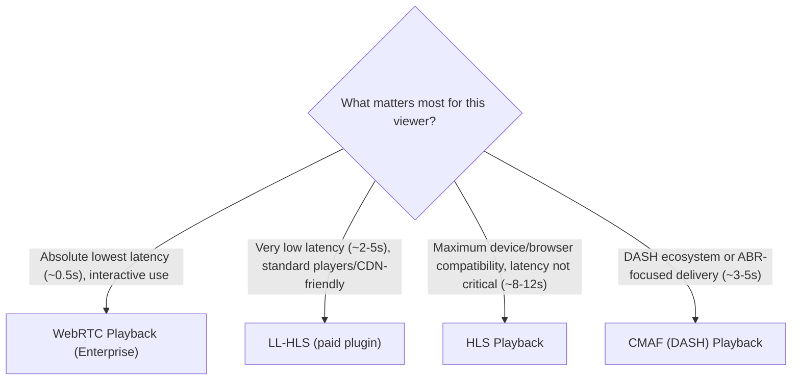

# Which Playback Method Should I Use?

Ant Media Server can deliver the same live stream through several playback protocols at once, and the right one for a given viewer depends on how much latency you can tolerate and what has to play the stream. Use this to find your path before diving into a specific guide:

## Sub-Second Latency

- **[WebRTC Playback](/guides/playing-live-stream/webrtc-playback/)** — the lowest latency option at roughly half a second, playable directly in the browser. Requires Enterprise Edition and open UDP ports. Best for interactive use cases (auctions, gaming, remote control) where viewers need to react to what they see in real time.

## Low Latency, Standard Players

- **[LL-HLS](/guides/playing-live-stream/ll-hls/)** — gets HLS's latency down to roughly 2-5 seconds by serving smaller "parts" instead of full segments, while staying close enough to standard HLS that most HLS-compatible players can handle it. It's a paid plugin (Enterprise v2.12+), so it's worth it specifically when WebRTC's browser/UDP requirements don't fit your setup but you still need better than HLS's default latency.

## Maximum Compatibility

- **[HLS Playback](/guides/playing-live-stream/hls-playing/)** — the default choice for broad reach. Works on both Community and Enterprise, plays natively on essentially every device and browser, and is the safest option when you don't control the playback environment. The trade-off is latency: typically 8-12 seconds behind live.

## DASH / ABR-Focused Delivery

- **[CMAF (DASH) Playback](/guides/playing-live-stream/dash-playing-cmaf/)** — delivers around 3-5 second latency using the same segment format DASH and HLS both build on, which makes it a good fit if your player stack or CDN is already built around MPEG-DASH rather than HLS.

## Once You're Playing

- **[Embedded Web Player](/guides/playing-live-stream/embedded-web-player/)** — drop any of the above protocols into your own website via `<iframe>` or the standalone Web Player component, instead of building a custom player.
- **[Stream Failover Playback](/guides/playing-live-stream/stream-failover-playback/)** — configure a backup stream that the player switches to automatically if the primary stream drops, for viewer-facing reliability.
