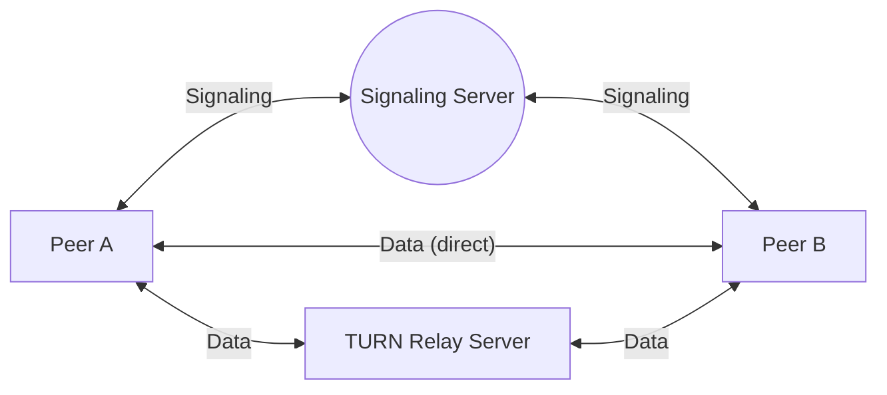

In this documentation, we're going to explain how to implement WebRTC peer-to-peer communication with JavaScript SDK. 

By the end of this guide, you'll have two browser tabs connected directly to each other in P2P mode, and know how to fall back to a TURN server when a direct connection isn't possible.

## Navigate to P2P Sample Page

There is already a working demo for this in the `peer.html` file.

Go to `https://<DOMAIN_NAME>:5443/live/peer.html` for a sample page.

If you have Ant Media Server installed on your local machine, you can also go to ```http://localhost:5080/live/peer.html```

- Input the streamId and click the join button.
- Now open the same page in a new browser tab or any other machine and click join. You're now connected in P2P mode directly from your browser.


### Join P2P Communication

When WebRTCAdaptor is successfully initialized, it establishes a web socket connection. Following a successful connection, the client receives an initialized notification from the server. After receiving ```initialized``` notification, call the```join``` method.

```js
webRTCAdaptor.join(streamId);
```

If the ```join``` method returns successful, the server responds with a ```joined``` notification. As a result, the ```callback``` method is called with joined notification.

### Leave P2P Communication

When you want to leave a peer-to-peer connection, just call the ```leave``` method.

```js
webRTCAdaptor.leave(streamId);
```

### Auxiliary Methods

The JavaScript SDK provides several auxiliary methods to provide enough flexibility in your application.

- **```turnOffLocalCamera```:** Turn off the local camera in WebRTC peer to peer communication.

   ```js
  webRTCAdaptor.turnOffLocalCamera(streamId);
   ```

- **```turnOnLocalCamera```:** Turn on the local camera in WebRTC peer-to-peer communication.

   ```js
  webRTCAdaptor.turnOnLocalCamera(streamId);
   ```
   
- **```muteLocalMic```:** Mutes the local microphone in WebRTC peer-to-peer communication.

   ```js
  webRTCAdaptor.muteLocalMic();
   ```

- **```unmuteLocalMic```:** Unmute the local microphone in WebRTC peer-to-peer communication.

   ```js
  webRTCAdaptor.unmuteLocalMic();
   ```
   
## TURN Server

In some cases, peer-to-peer communication cannot be established and a relay server is required for video/audio transmission. For this requirement, TURN servers are needed to relay the video/audio.



Signaling always goes through the server so both peers can exchange connection details. Media only takes the direct path when NAT/firewall traversal succeeds — otherwise it falls back to relaying through the TURN server.

Check out this [**TURN server document**](/guides/advanced-usage/turn-installation/coturn-quick-installation/) for the configuration.

You can configure TURN server credentials in [peer.html](https://github.com/ant-media/StreamApp/blob/master/src/main/webapp/peer.html) as follows.

```js
var pc_config =
{
  'iceServers' : 
      [ {
        'urls' : 'turnServerURL',
        'username' : 'turnServerUsername',
        'credential' : 'turnServerCredential'
      } ]
};
```

You now have two peers connected directly over WebRTC, with a TURN server configured as a fallback for when direct connections fail. From here, integrate the `join`/`leave` calls above into your own application.

## Need Help?

If two peers can't connect directly, that's usually a NAT/firewall issue — see the TURN server section above. Otherwise, reach out on [GitHub Discussions](https://github.com/orgs/ant-media/discussions) or contact [Technical Support](mailto:support@antmedia.io).
