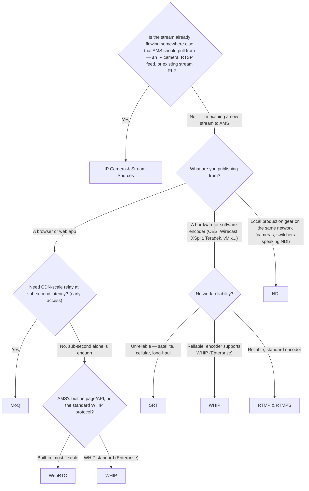

# Which Protocol Should I Use to Publish?

Ant Media Server accepts a stream in several different ways, and the right one depends less on personal preference than on what you're actually publishing from and what you need out of it. Use this to find your path before diving into a specific guide:

## Publishing From a Browser or Web App

- **[WebRTC](/guides/publish-live-stream/webrtc/)** — the default choice. Sub-second latency, works directly in the browser with no plugins, and AMS's built-in publish page gets you started in minutes. Works on both Community and Enterprise.
- **[WHIP](/guides/publish-live-stream/webrtc/whip/)** — the same WebRTC transport, signaled over a standard HTTP-based protocol instead of AMS's own API. Worth it if you're integrating a third-party WHIP client or need interoperability across WebRTC servers. Requires Enterprise Edition (v2.10+).
- **[MoQ](/guides/publish-live-stream/moq/)** — sub-second latency like WebRTC, but designed to scale through a CDN relay the way HLS does. It's getting a lot of industry attention right now and is genuinely worth evaluating if CDN-scale low latency is on your roadmap — but it's still early access on both the IETF spec side and AMS's own plugin (separate install, Chromium/Safari 26.4+ playback, requires AMS 3.0.0+), so it isn't yet the safe default for production.

## Publishing From a Hardware or Software Encoder

Most encoders — OBS, Wirecast, XSplit, Teradek, vMix, and virtually every hardware encoder on the market — speak RTMP by default, which is why it's still the most broadly compatible option and the one most social platforms require on their end too.

- **[RTMP, RTMPS & Enhanced RTMP](/guides/publish-live-stream/rtmp/)** — the default for encoder-based publishing. If you're not sure which to pick, start here.
- **[SRT](/guides/publish-live-stream/srt/)** — choose this instead if you're contributing over an unreliable network (satellite, cellular, long-haul internet). SRT's error correction handles packet loss RTMP can't.
- **[WHIP](/guides/publish-live-stream/webrtc/whip/)** — if your encoder specifically supports it (OBS 30+ does) and you're on Enterprise, WHIP gets you WebRTC's latency from a traditional encoder.

## Publishing From Local Production Gear

- **[NDI](/guides/publish-live-stream/ndi/)** — for cameras, switchers, and production tools that already speak NDI on your local network. This is for the same-LAN production workflow, not internet-facing publishing.

## Pulling From an Existing Source

If AMS should reach out and pull a stream instead of receiving one pushed to it — an IP camera, an existing RTSP feed, or another stream URL — see **[IP Camera & Stream Sources](/category/ip-camera--stream-sources/)** instead. This is the one case above that isn't really a "protocol choice" so much as a different publishing model entirely.

## Once You're Publishing

- **[Restreaming](/guides/publish-live-stream/restreaming/)** — send an already-ingested stream onward to another RTMP/SRT destination, for example simulcasting to a social platform.
- **[Multitrack Publish and Play](/guides/publish-live-stream/multitrack-publish-and-play-with-ams/)** — publish and play multiple audio/video tracks within a single session.
- **[Playlist](/guides/publish-live-stream/playlist/)** — schedule VOD content to play out as a live stream.
