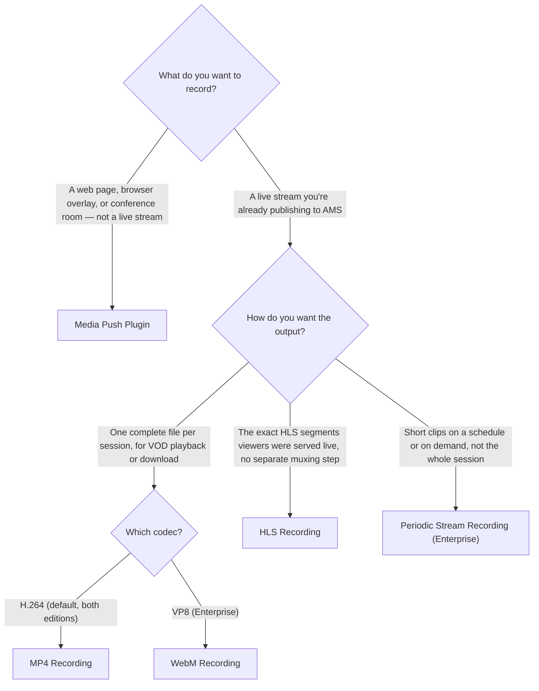

# Which Recording Method Should I Use?

Ant Media Server can record what's happening in more than one way, and the right method depends on what you're actually capturing and how you need the result to come out. Use this to find your path before diving into a specific guide:

## Recording the Whole Stream as One File

- **[MP4 & WebM Recording](/guides/recording-live-streams/mp4-and-webm-recording/)** — the default choice for a complete, downloadable recording of a session. MP4 (H.264) works on both editions and needs no extra setup beyond enabling it; WebM (VP8) is an Enterprise-only alternative for when your pipeline specifically needs that codec. Supports adaptive bitrate variants and per-stream control via the REST API.

## Keeping the Live HLS Segments As-Is

- **[HLS Recording](/guides/recording-live-streams/hls-recording/)** — instead of muxing a separate MP4 after the fact, this keeps the same `.m3u8`/`.ts` files viewers were served live. Worth it if your downstream pipeline already expects HLS output, or if you want to push segments to a remote endpoint or S3-compatible bucket in real time as they're generated, rather than waiting for the full recording to finish.

## Short Clips Instead of the Whole Session

- **[Periodic Stream Recording](/guides/recording-live-streams/periodic-stream-recording/)** — an Enterprise plugin for generating short MP4 clips on a schedule or on demand via the REST API, without recording (or storing) the entire session. Best fit for highlights, snippets, or any workflow where you only need specific moments rather than continuous footage.

## Capturing a Web Page Instead of a Stream

- **[Media Push Plugin](/guides/recording-live-streams/media-push-plugin/)** — when what you need to record isn't a live stream at all but a web page, browser-based overlay, or conference room, this loads the page server-side and captures it as a stream you can then record with any of the methods above.

## Once You're Recording

- **[Cloud Storage Integration](/category/s3-recording-and-integration)** — automatically upload finished recordings to S3, GCS, Azure, or another provider instead of keeping them on local disk.
- **[HTTP Forwarding](/guides/recording-live-streams/http-forwarding/)** — required once recordings live in cloud storage, so playback URLs still resolve through Ant Media Server instead of 404ing.
- **[Play Recorded Files](/guides/recording-live-streams/playing-recorded-files/)** — play back what you've recorded, directly by URL or through the embedded player.
