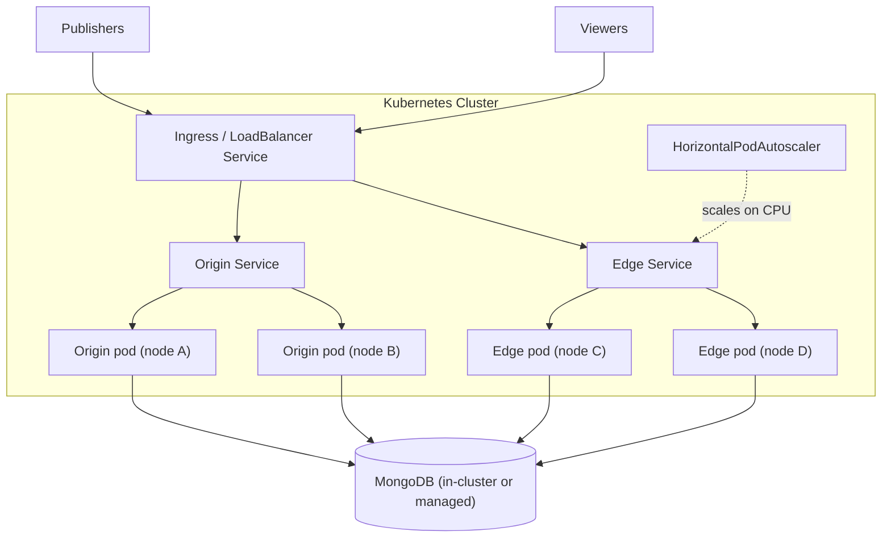

# Kubernetes Autoscaling

Running Ant Media Server on Kubernetes gives you declarative infrastructure, self-healing, and horizontal autoscaling of the edge group based on load.

## Architecture

## Key design constraints

- **One pod per node:** Ant Media Server pods use `hostNetwork: true` because WebRTC needs a wide UDP port range. This means only one AMS pod fits per Kubernetes node, and autoscaling pods effectively means autoscaling nodes (pair the HPA with the cluster autoscaler).
- **Origin/edge separation via labels:** origin and edge are separate Deployments with distinct labels; Services select on those labels so publish traffic reaches origins and play traffic reaches edges.
- **Anti-affinity:** pod anti-affinity rules keep AMS pods on separate nodes.

## Sizing and autoscaling

- Set CPU requests/limits per pod based on your load test results for the chosen node instance type.
- Configure the HorizontalPodAutoscaler on the **edge deployment** with a CPU target around 60%, leaving headroom for viewer bursts while new nodes come up.
- Origins usually scale manually or on publisher-count schedules, since ingest load is more predictable than viewer load.
- Node startup time (cloud autoscaler provisioning + pod start) is typically 2-5 minutes; plan burst headroom accordingly.

## Failure modes

| Failure | Impact | Mitigation |
| ------- | ------ | ---------- |
| Node/pod failure | Kubernetes reschedules the pod on a new node; streams on the failed node drop and clients reconnect | SDK reconnect logic; N+1 capacity |
| Autoscaler lag during viewer spike | Temporary capacity shortfall on edges | Lower HPA target, pre-scale before planned events |
| MongoDB unavailability | Cluster coordination stops | Use a managed MongoDB (Atlas) or an in-cluster replica set with persistent volumes |
| Misconfigured ports/hostNetwork | WebRTC fails while HTTP works | Verify UDP 50000-60000 reachability to nodes; see [WebRTC troubleshooting](/guides/troubleshooting/webrtc-publish-play-issues/) |

## Setup guides

- [Deploy AMS on Kubernetes](/guides/clustering-and-scaling/kubernetes/deploy-ams-on-kubernetes/)
- [Deploy with Helm](/guides/clustering-and-scaling/kubernetes/deploy-ams-with-helm/)
- Managed Kubernetes: [EKS](/guides/clustering-and-scaling/kubernetes/kubernetes-services/installing-ams-on-aws-eks/), [GKE](/guides/clustering-and-scaling/kubernetes/kubernetes-services/installing-ams-on-google-gke/), [AKS](/guides/clustering-and-scaling/kubernetes/kubernetes-services/installing-ams-on-azure-aks/), [DigitalOcean](/guides/clustering-and-scaling/kubernetes/kubernetes-services/install-ams-at-digital-ocean/)
