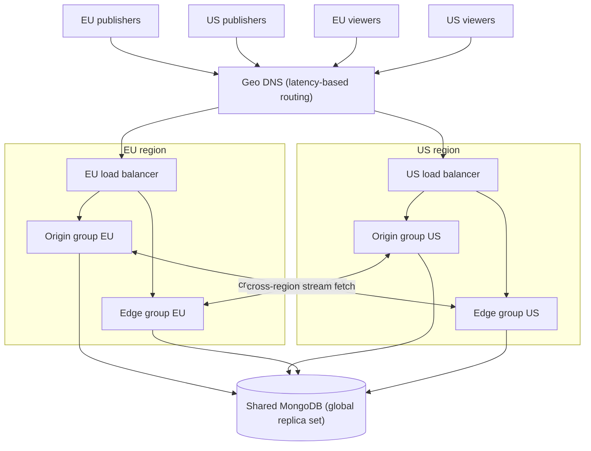
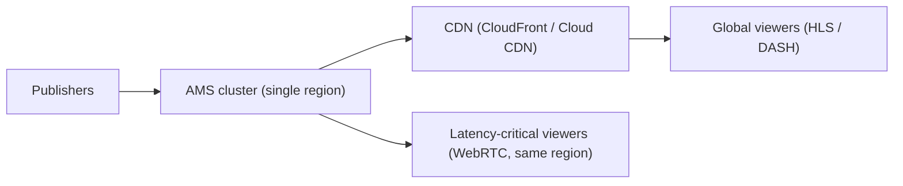

# Multi-Region Deployment

Serving a global audience from a single region adds latency for distant viewers. There are two main strategies: a **multi-region AMS cluster** for end-to-end low latency, or a **CDN offload** for HLS/DASH viewers where sub-second latency is not required.

## Strategy 1: Multi-region cluster (low latency everywhere)

Publishers stream to the nearest origin; edges in each region serve local viewers. Geo-aware DNS (for example Route 53 latency-based routing) directs users to their closest entry point.

### Honest trade-offs

- **Cross-region stream fetches** happen when a viewer's region differs from the stream's origin region. This traffic crosses region boundaries (egress cost, added latency of one region hop).
- **The shared database** is a coordination point. Use a MongoDB global replica set (or a managed global database) and accept that cross-region database latency affects stream registration operations, not media flow.
- **Operational complexity** roughly doubles per added region: monitoring, upgrades, and capacity planning are per-region.

See the [AWS global cluster guide](/guides/clustering-and-scaling/aws/aws-cloudformation/ant-media-global-cluster-on-aws/) for a worked AWS example, and [multi-level cluster](/guides/clustering-and-scaling/manual-configuration/multi-level-cluster/) for very large fan-out.

## Strategy 2: Regional ingest + CDN delivery (simpler, higher latency)

If most viewers can tolerate HLS/DASH latency (seconds rather than sub-second), keep the AMS cluster in one region and let a CDN handle global delivery of HLS/DASH output:

This hybrid keeps WebRTC for the users who need real-time interaction and offloads the long tail of passive viewers to the CDN. Setup guides: [Amazon CloudFront](/guides/cdn-integration/amazon-cloudfront/), [GCP Cloud CDN](/guides/cdn-integration/gcp-cloud-cdn/).

## Choosing between the strategies

| Criterion | Multi-region cluster | Single region + CDN |
| --------- | -------------------- | ------------------- |
| Viewer latency | Sub-second everywhere | Sub-second near the region, seconds elsewhere |
| Cost | Higher (instances + cross-region egress) | Lower (CDN egress is cheap at scale) |
| Complexity | High | Moderate |
| Best for | Interactive use cases (auctions, conferencing, betting) | Broadcast-style viewing at global scale |

## Failure modes (multi-region cluster)

| Failure | Impact | Mitigation |
| ------- | ------ | ---------- |
| Region outage | Streams and viewers in that region are lost; DNS shifts new traffic to healthy regions | Health-checked DNS failover; capacity headroom in surviving regions |
| Cross-region link degradation | Choppy playback for cross-region viewers | Monitor inter-region latency; prefer keeping publisher and audience in the same region when possible |
| Global database issues | New stream registration fails everywhere | Managed global database with automatic failover; alerting on replication lag |
