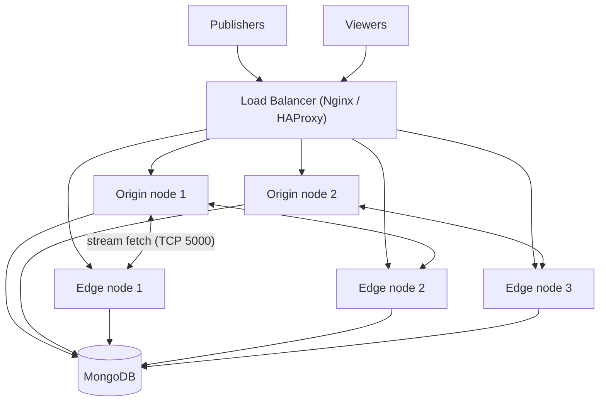

# Origin-Edge Cluster

The standard architecture for scaling beyond one machine. Publishers are ingested by **origin** nodes, viewers are served by **edge** nodes, shared state lives in **MongoDB**, and a **load balancer** is the single entry point.

## Architecture

## Role separation

| Component | Role | Notes |
| --------- | ---- | ----- |
| Origin group | Ingest, transcoding, transmuxing | Put GPUs here if ABR is enabled; viewers never connect to origins directly |
| Edge group | Fetch from origin, deliver to viewers | No transcoding; scale this group with viewer count |
| MongoDB | Stream metadata, node registry | Use a replica set in production; see [supported databases](/guides/clustering-and-scaling/supported-databases/scaling-with-mongodb-atlas/) |
| Load balancer | Entry point, SSL termination | Routes publish traffic to origins and play traffic to edges |

## Sizing

- **Origins:** scale with publisher count and transcoding load. Compute-optimized instances; GPU if ABR renditions exceed what CPU comfortably encodes.
- **Edges:** scale with viewer count. An edge fetches each stream from its origin **once** and fans out to its local viewers, so edge count grows roughly linearly with total viewers.
- **MongoDB:** modest sizing is usually sufficient; IOPS and the open-file limit matter more than CPU (see [cluster installation](/guides/clustering-and-scaling/manual-configuration/cluster-installation/#configure-mongodb-limits)).
- Validate with [load testing](/guides/configuration-and-testing/load-testing/webrtc-load-testing/) before production.

## Network requirements

- TCP **5000** open between all nodes (internal only, never public).
- MongoDB port **27017** reachable from all nodes (internal only).
- UDP **50000-60000** open on nodes for WebRTC media.
- SSL terminated at the load balancer with a valid certificate.

## Failure modes

| Failure | Impact | Mitigation |
| ------- | ------ | ---------- |
| Origin node fails | Streams ingested by that node drop; publishers must reconnect (load balancer routes them to a healthy origin) | Client-side reconnect logic (built into the SDKs); keep at least 2 origins |
| Edge node fails | Viewers on that edge reconnect via the load balancer to another edge | Health checks on the load balancer; keep N+1 edge capacity |
| MongoDB down | New streams cannot register; cluster coordination stops | MongoDB replica set with automatic failover |
| Load balancer fails | Full outage | Managed load balancer (cloud) or keepalived/VRRP pair for self-hosted |
| Origin-edge link congestion | Choppy playback on affected edges | Keep nodes in the same region/VPC; monitor inter-node bandwidth |

## Setup guides

- [Cluster installation](/guides/clustering-and-scaling/manual-configuration/cluster-installation/)
- [Nginx load balancer](/guides/clustering-and-scaling/load-balancing/nginx-load-balancer/) / [HAProxy](/guides/clustering-and-scaling/load-balancing/haproxy-load-balancer/)
- Platform-specific: [AWS](/guides/clustering-and-scaling/aws/clustering-with-aws/), [Azure](/guides/clustering-and-scaling/azure/setup-ams-clustering-at-azure/), [GCP](/guides/clustering-and-scaling/gcp/gcp-cluster-deployment/)
- [Multi-level cluster](/guides/clustering-and-scaling/manual-configuration/multi-level-cluster/) for very large viewer counts
