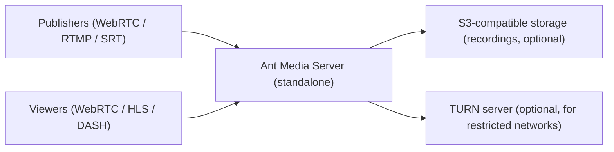

# Single Node Production

The simplest production deployment: one Ant Media Server instance serving publishers and viewers directly. Suitable for small to medium workloads where a short recovery time after instance failure is acceptable.

## Architecture

## When to use it

- Predictable, moderate concurrent load that a single machine can handle.
- Simpler operations: no cluster database, no load balancer.
- Cost-sensitive deployments.

## Sizing

Minimum production baseline: **4 vCPUs (compute-optimized), 8 GB RAM, SSD storage**.

Capacity depends heavily on codec, resolution, transcoding, and protocol mix. As rough planning inputs:

- **WebRTC pass-through (no transcoding)** scales primarily with network and CPU for packet handling.
- **Adaptive bitrate transcoding** is the dominant CPU cost. Each additional ABR rendition multiplies encoding load; use an [Nvidia GPU](/guides/advanced-usage/using-nvidia-gpu/) when transcoding more than a handful of streams.
- **HLS/DASH viewers** are cheap per viewer (HTTP file serving); WebRTC viewers cost more CPU per viewer.

Do not guess: run the [load testing tools](/guides/configuration-and-testing/load-testing/webrtc-load-testing/) against your exact instance type and stream profile before committing to capacity numbers.

## Failure modes

| Failure | Impact | Mitigation |
| ------- | ------ | ---------- |
| Instance crash / hardware failure | All streams drop until the instance is replaced | Automate provisioning (cloud image or install script) so recovery is minutes, not hours; keep configuration backed up |
| CPU/memory exhaustion | New publishers rejected ("Resource Usage is High"), degraded streams | Alert at 70% sustained usage; see [high CPU & memory](/guides/troubleshooting/high-cpu-and-memory/) |
| Disk full | Recording failures, potential instability | Alert on disk usage; offload recordings to [S3](/guides/recording-live-streams/s3-recording-and-integration/aws-s3/) |
| Certificate expiry | Browsers refuse WebRTC connections | Use Let's Encrypt auto-renewal via the [SSL setup](/guides/installing-on-linux/setting-up-ssl/) |

## Growth path

When a single node is no longer enough, the next step is an [origin-edge cluster](/guides/reference-architectures/origin-edge-cluster/). Application settings carry over; plan the migration during a maintenance window.

## Setup guides

- [Installing on Linux](/guides/installing-on-linux/installing-ams-on-linux/)
- [SSL setup](/guides/installing-on-linux/setting-up-ssl/)
- [Production checklist](/get-started/enterprise-guide/)
